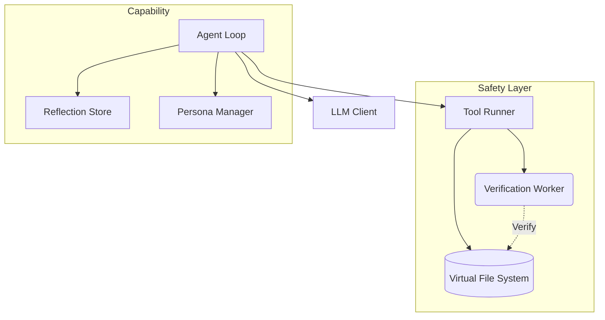

# Reploid: Recursive Self-Improvement Substrate

> A long-running browser-native system that can modify its own code.

**R**ecursive **E**volution **P**rotocol **L**oop **O**ptimizing **I**ntelligent **D**REAMER
(**D**ynamic **R**ecursive **E**ngine **A**dapting **M**odules **E**volving **R**EPLOID)
→ REPLOID ↔ DREAMER ↔ ∞

---

## About

Reploid is a **self-modifying AI substrate** that demonstrates recursive self-improvement ([RSI](https://en.wikipedia.org/wiki/Recursive_self-improvement)) in a browser environment.

**How:** The agent reads code from its VFS → analyzes & improves it → writes back to VFS → hot-reloads → evolves.

The agent's "brain" is data in [IndexedDB](https://developer.mozilla.org/en-US/docs/Web/API/IndexedDB_API). It can modify this data (its own code) while running.

---

## Architecture



### Key Components

1.  **Core Substrate**:
    *   `agent-loop.js`: The main cognitive cycle (Think -> Act -> Observe).
    *   `vfs.js`: Browser-native file system using IndexedDB.
    *   `llm-client.js`: Unified interface for Cloud (Proxy) and Local (WebLLM) models.

2.  **Safety Mechanisms**:
    *   **Verification Worker**: Runs proposed code changes in a sandboxed Web Worker to check for syntax errors and malicious patterns (infinite loops, `eval`) before writing to VFS.
    *   **Genesis Factory**: Creates immutable snapshots ("Lifeboats") of the kernel for recovery.

3.  **Tools**:
    *   `code_intel`: Lightweight structural analysis (imports/exports) to save context tokens.
    *   `read/write_file`: VFS manipulation.
    *   `python_tool`: Execute Python via Pyodide (WASM).

---

## RSI Levels

1.  **Level 1 (Tools):** Agent creates new tools at runtime using `create_tool`.
2.  **Level 2 (Meta):** Agent improves its own tool creation mechanism.
3.  **Level 3 (Substrate):** Agent re-architects its entire loop or memory system.

---

## RSI Examples

### Example 1: Tool Creation (Level 1)
**Goal:** "Create a tool that adds two numbers"

```
[Agent] Iteration 1: Analyzing goal...
[Agent] I need a tool to add numbers
[TOOL_CALL] create_tool
[ARGS] {
  name: "add_numbers",
  code: "export default async function({a, b}) { return a + b; }"
}
[TOOL_RESULT] ✓ Tool created: /tools/add_numbers.js
[Agent] Testing new tool...
[TOOL_CALL] add_numbers
[ARGS] {a: 5, b: 3}
[TOOL_RESULT] 8
[Agent] ✓ Goal complete
```

### Example 2: Meta-Tool Creation (Level 2)
**Goal:** "Build a system that creates tools from descriptions"

```
[Agent] Iteration 1: I need a meta-tool
[TOOL_CALL] create_tool
[ARGS] {
  name: "create_tool_from_description",
  code: `export default async function({description}) {
    // Call LLM to generate code from description
    const code = await call_llm({
      prompt: "Generate JavaScript function: " + description
    });

    // Create the tool
    const toolName = description.split(' ')[0].toLowerCase();
    await executeTool('create_tool', {name: toolName, code});
    return {success: true, tool: toolName};
  }`
}
[TOOL_RESULT] ✓ Meta-tool created
[Agent] Iteration 2: Testing meta-tool...
[TOOL_CALL] create_tool_from_description
[ARGS] {description: "Parse JSON and extract errors"}
[TOOL_RESULT] ✓ Created tool: parse
[Agent] I just created a tool-creating tool! (Level 2 RSI)
```

### Example 3: Substrate Modification (Level 3)
**Goal:** "Analyze your tool creation process and optimize it"

```
[Agent] Iteration 1: Reading my own tool-writer...
[TOOL_CALL] read_file
[ARGS] {path: "/core/tool-writer.js"}
[TOOL_RESULT] [1200 lines of code]
[Agent] I see the bottleneck: validation runs on every call
[Agent] Iteration 2: Improving myself...
[TOOL_CALL] improve_core_module
[ARGS] {
  module: "tool-writer",
  code: "... version with AST caching ..."
}
[TOOL_RESULT] ✓ Backed up /core/tool-writer.js.backup.1763000000
[TOOL_RESULT] ✓ Module hot-reloaded
[Agent] Iteration 3: Testing improvement...
[TOOL_CALL] create_tool
[ARGS] {name: "test_tool", code: "..."}
[TOOL_RESULT] ✓ Created in 0.3s (was 2.1s before)
[Agent] I just made myself faster! (Level 3 RSI)
```

---

## Landscape

Reploid lives in a small but rapidly evolving ecosystem of self-improving agents. We intentionally share compute constraints (browser, IndexedDB) while diverging on safety architecture and ownership.

### WebLLM (MLC AI)
WebLLM is the inference engine reploid can stand on: deterministic WebGPU execution. It excels at raw token throughput and versioned stability but offers no tools, memory, or self-modification. REPLOID layers VFS, a tool runner, PAWS governance, and substrate/capability boundaries above WebLLM so passive inference becomes an auditable agent capable of planning, testing, and rewriting itself safely.

### OpenHands (formerly OpenDevin)
OpenHands embraces Docker power (shell, compilers, sudo) to tackle arbitrary repos, yet that freedom kills safety—the agent can brick its container with a single bad edit. REPLOID trades GCC for transactional rollback: everything lives inside a browser tab, checkpoints live in IndexedDB, and humans approve cats/dogs diffs before mutations land. We prioritize experimentation accessibility and undo guarantees over unrestricted OS access.

### Gödel Agent
Gödel Agent explores theoretical RSI by letting reward functions and logic rewrite themselves. It is fascinating math, but it lacks persistent state management, tooling, or human guardrails, so "reward hacking" is inevitable. REPLOID focuses on engineering: reproducible bundles, hot-reloadable modules, and EventBus-driven UI so observers can inspect every mutation. We sacrifice unconstrained search space for transparency and hands-on controllability.

### Devin (Cognition)
Devin shows what proprietary, cloud-scale orchestration can deliver: GPT-4-class reasoning, hosted shells, and long-running plans. But it is a black box—you cannot audit, fork, or run Devin offline. REPLOID is the opposite: a glass-box brain stored locally, fully inspectable and modifiable by its owner. We bet that sovereign, user-controlled RSI will outpace closed SaaS once users can watch and influence every self-improvement step.

| Feature               | REPLOID                | OpenHands          | Gödel Agent           | Devin          |
|-----------------------|------------------------|--------------------|-----------------------|----------------|
| Infrastructure        | **Browser (WebGPU/IDB)** | Docker/Linux       | Python/Research       | Cloud SaaS     |
| Self-Mod Safety       | **High (Worker sandbox + Genesis Kernel)** | Low (root access)  | Low (algorithm focus) | N/A (closed)   |
| Human Control         | **Granular (PAWS review)**   | Moderate (Stop btn) | Low (automated)        | Moderate (chat)|
| Recovery              | **Transactional rollback**  | Container reset   | Script restart        | N/A            |

**Why REPLOID is different:** Explores the "Ship of Theseus" problem in a tab. Capabilities can mutate aggressively, but the substrate remains recoverable thanks to immutable genesis modules, and IndexedDB checkpoints.

---

## Philosophy

Reploid is an experiment in [**substrate-independent RSI**](https://www.edge.org/response-detail/27126):

- The agent's "brain" is just data in IndexedDB
- The agent can modify this data (its own code)
- The original source code (genesis) is the evolutionary starting point
- Every agent instance can evolve differently

**Analogy:**
- **DNA** = source code on disk (genesis)
- **Organism** = runtime state in IndexedDB (evolved)
- **Mutations** = agent self-modifications
- **Fitness** = agent-measured improvements (faster, better, smarter)

**Key Question:** Can an AI improve itself faster than humans can improve it?

---

## License

MIT
