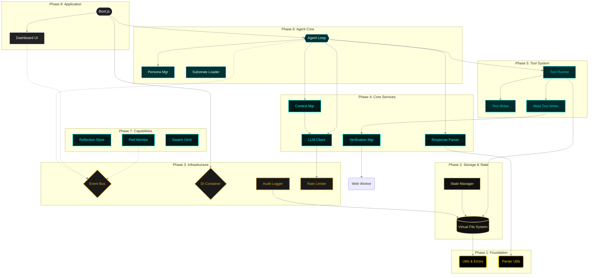

# REPLOID: Recursive Self-Improvement Substrate

> A browser native system that can modify its own code.

**R**ecursive **E**volution **P**rotocol **L**oop **O**ptimizing **I**ntelligent **D**REAMER
(**D**ynamic **R**ecursive **E**ngine **A**dapting **M**odules **E**volving **R**EPLOID)
→ REPLOID ↔ DREAMER ↔ ∞

---

## What is This?

REPLOID is not an AI assistant. It's a **self-modifying AI substrate** that demonstrates recursive self-improvement (RSI) in a browser environment.

**How it works:** The agent reads code from its VFS → analyzes & improves it → writes back to VFS → hot-reloads → becomes better.

**Key insight:** The agent's "brain" is data in [IndexedDB](https://developer.mozilla.org/en-US/docs/Web/API/IndexedDB_API). It can modify this data (its own code) while running. The original source code is just the evolutionary starting point ("genesis").

**RSI stages:**
1. **Level 1:** Agent creates new tools at runtime.
2. **Level 2:** Agent improves its own tool creation mechanism.
3. **Level 3:** Agent modifies core substrate modules (its memory, prompts, or loop).

---

## Why Does This Matter?

Most AI systems are frozen at deployment. REPLOID can:
- Create new tools during execution
- Improve its own tool creation mechanism
- Modify its core cognitive loop
- Persist its evolution locally (no cloud)

This is one of many research projects exploring what happens when you give an AI the ability to rewrite itself.

---



### Data Flow & Persistence

```mermaid
graph LR
    classDef actor fill:#222,stroke:#fff,stroke-width:2px,color:#fff;
    classDef logic fill:#003333,stroke:#00CED1,stroke-width:2px,color:#E0FFFF;
    classDef file fill:#000,stroke:#DAA520,stroke-width:1px,stroke-dasharray: 5 5,color:#F0E68C;
    classDef worker fill:#330033,stroke:#FF00FF,stroke-width:2px,color:#FF00FF;

    Agent{{Agent Loop}}:::actor
    StateMgr[State Manager]:::logic
    MetaTool[Meta Tool Writer]:::logic
    Verify[Verification Mgr]:::logic
    Worker(Web Worker Context):::worker

    subgraph VFS [Virtual File System (IndexedDB)]
        StateFile(/.system/state.json):::file
        CoreFile(/core/*.js):::file
        WorkerFile(/core/verification-worker.js):::file
        AuditLog(/.logs/audit/YYYY-MM-DD.jsonl):::file
    end

    Agent -- Update Goal --> StateMgr
    StateMgr -- Read/Write --> StateFile
    
    Agent -- "improve_core_module" --> MetaTool
    MetaTool -- Read Source --> CoreFile
    MetaTool -- Validate --> Verify
    
    Verify -- Load --> WorkerFile
    Verify -- "postMessage({snapshot})" --> Worker
    Worker -- "onmessage(passed)" --> Verify
    
    Verify -- Success --> MetaTool
    MetaTool -- Write Update --> CoreFile
    
    StateMgr -- Audit Events --> AuditLog
```

---

## Quick Start

1. **Clone or download** this repo and open `/reploid/index.html` in Chrome/Edge with WebGPU enabled.
2. **Choose a genesis level** on the boot screen (Full Substrate for first runs).
3. **Add a model** (API key or local WebLLM). The UI lists all four connection types.
4. **Awaken the agent.** Watch the boot log, then let REPLOID run unattended or issue goals through the chat panel.
5. **Review every proposal.** Cats bundles capture context; dogs bundles capture diffs. Approve, edit, or rollback from the diff viewer.

Need details on proxies, Ollama, or advanced settings? See `/boot/README.md`.

---

## Safety Architecture

REPLOID’s core bet is that RSI must be observable, reversible, and crash-proof:

- **Substrate / Capability boundary:** Immutable genesis modules (agent loop, response parser, context manager) live in an “untouchable” zone. Everything else is fair game for the agent to rewrite.
- **Pre-flight verification:** Code changes are compiled and tested inside an isolated [Web Worker](https://developer.mozilla.org/en-US/docs/Web/API/Web_Workers_API) before they touch the main thread. If the worker crashes, the change is rejected.
- **Safe Mode bootloader:** When everything still goes wrong, the bootloader detects crash loops and offers to boot from the immutable Genesis Kernel—your built-in lifeboat.
- **Cats/Dogs protocol:** All code changes flow through structured bundles. Humans (or other agents) review diffs before they hit VFS.
- **Checkpointed VFS:** Git-style snapshots in IndexedDB plus StateManager checkpoints give you an immediate undo button—even mid-iteration.

These guardrails make it safe to watch the "[Ship of Theseus](https://en.wikipedia.org/wiki/Ship_of_Theseus)" rebuild itself in real time.

---

## PAWS Governance

PAWS is the structured handshake between human and agent that keeps RSI sane. Instead of letting the agent hack files directly, every action flows through two artifacts:

- **Cats bundle (input):** A curated snapshot of the files relevant to the current task. The agent never “sees” the entire project; it reasons over a focused view.
- **Dogs bundle (output):** A transactional change proposal with explicit CREATE/MODIFY/DELETE blocks. Nothing executes until a reviewer approves it.

This firewall prevents “brain death” (accidentally corrupting the runtime) and unlocks practical benefits:

1. **Context economy:** Cats bundling forces selective reading, keeping prompts small and focused so the agent doesn’t thrash token limits.
2. **Atomic transactions:** Dogs bundles apply in one shot. If pre-flight verification or human review fails, the whole change is rejected. You can also rollback by checkpoint ID—think miniature [database transactions](https://en.wikipedia.org/wiki/Database_transaction) for code changes.
3. **Asynchronous workflow:** The agent can queue multiple proposals overnight; humans (or scripts) review diffs later and pick the best bundle to apply.

PAWS costs a review step, but it makes high-stakes RSI possible without lobotomizing the agent mid-upgrade.

---

## Learn More

- Genesis tiers, module maps, and wiring diagrams live in `/core/README.md` and `/blueprints/README.md`.
- Connection modes, proxies, and local LLM guidance are documented in `/boot/README.md` and `/docs/OPERATIONAL_MODES.md`.
- Blueprints, personas, and promotion protocols are in `/blueprints/` and `/upgrades/`.

Skim those when you want the full reference manual; the rest of this README stays focused on behavior, experiments, and positioning.

---

## RSI Examples

### Example 1: Tool Creation (Level 1)
**Goal:** "Create a tool that adds two numbers"

```
[Agent] Iteration 1: Analyzing goal...
[Agent] I need a tool to add numbers
[TOOL_CALL] create_tool
[ARGS] {
  name: "add_numbers",
  code: "export default async function({a, b}) { return a + b; }"
}
[TOOL_RESULT] ✓ Tool created: /tools/add_numbers.js
[Agent] Testing new tool...
[TOOL_CALL] add_numbers
[ARGS] {a: 5, b: 3}
[TOOL_RESULT] 8
[Agent] ✓ Goal complete
```

### Example 2: Meta-Tool Creation (Level 2)
**Goal:** "Build a system that creates tools from descriptions"

```
[Agent] Iteration 1: I need a meta-tool
[TOOL_CALL] create_tool
[ARGS] {
  name: "create_tool_from_description",
  code: `export default async function({description}) {
    // Call LLM to generate code from description
    const code = await call_llm({
      prompt: "Generate JavaScript function: " + description
    });

    // Create the tool
    const toolName = description.split(' ')[0].toLowerCase();
    await executeTool('create_tool', {name: toolName, code});
    return {success: true, tool: toolName};
  }`
}
[TOOL_RESULT] ✓ Meta-tool created
[Agent] Iteration 2: Testing meta-tool...
[TOOL_CALL] create_tool_from_description
[ARGS] {description: "Parse JSON and extract errors"}
[TOOL_RESULT] ✓ Created tool: parse
[Agent] I just created a tool-creating tool! (Level 2 RSI)
```

### Example 3: Substrate Modification (Level 3)
**Goal:** "Analyze your tool creation process and optimize it"

```
[Agent] Iteration 1: Reading my own tool-writer...
[TOOL_CALL] read_file
[ARGS] {path: "/core/tool-writer.js"}
[TOOL_RESULT] [1200 lines of code]
[Agent] I see the bottleneck: validation runs on every call
[Agent] Iteration 2: Improving myself...
[TOOL_CALL] improve_core_module
[ARGS] {
  module: "tool-writer",
  code: "... version with AST caching ..."
}
[TOOL_RESULT] ✓ Backed up /core/tool-writer.js.backup.1763000000
[TOOL_RESULT] ✓ Module hot-reloaded
[Agent] Iteration 3: Testing improvement...
[TOOL_CALL] create_tool
[ARGS] {name: "test_tool", code: "..."}
[TOOL_RESULT] ✓ Created in 0.3s (was 2.1s before)
[Agent] I just made myself faster! (Level 3 RSI)
```

---

## Competitive Landscape

REPLOID lives in a small but rapidly evolving ecosystem of self-improving agents. We intentionally share compute constraints (browser, IndexedDB) while diverging on safety architecture and ownership.

### WebLLM (MLC AI)
WebLLM is the inference engine we stand on: deterministic WebGPU execution, no cognition. It excels at raw token throughput and versioned stability but offers no tools, memory, or self-modification. REPLOID layers VFS, a tool runner, PAWS governance, and substrate/capability boundaries above WebLLM so passive inference becomes an auditable agent capable of planning, testing, and rewriting itself safely.

### OpenHands (formerly OpenDevin)
OpenHands embraces Docker power (shell, compilers, sudo) to tackle arbitrary repos, yet that freedom kills safety—the agent can brick its container with a single bad edit. REPLOID trades GCC for transactional rollback: everything lives inside a browser tab, checkpoints live in IndexedDB, and humans approve cats/dogs diffs before mutations land. We prioritize experimentation accessibility and undo guarantees over unrestricted OS access.

### Gödel Agent
Gödel Agent explores theoretical RSI by letting reward functions and logic rewrite themselves. It is fascinating math, but it lacks persistent state management, tooling, or human guardrails, so “reward hacking” is inevitable. REPLOID focuses on engineering: reproducible bundles, hot-reloadable modules, and EventBus-driven UI so observers can inspect every mutation. We sacrifice unconstrained search space for transparency and hands-on controllability.

### Devin (Cognition)
Devin shows what proprietary, cloud-scale orchestration can deliver: GPT-4-class reasoning, hosted shells, and long-running plans. But it is a black box—you cannot audit, fork, or run Devin offline. REPLOID is the opposite: a glass-box brain stored locally, fully inspectable and modifiable by its owner. We bet that sovereign, user-controlled RSI will outpace closed SaaS once users can watch and influence every self-improvement step.

| Feature               | REPLOID                | OpenHands          | Gödel Agent           | Devin          |
|-----------------------|------------------------|--------------------|-----------------------|----------------|
| Infrastructure        | **Browser (WebGPU/IDB)** | Docker/Linux       | Python/Research       | Cloud SaaS     |
| Self-Mod Safety       | **High (Worker sandbox + Genesis Kernel)** | Low (root access)  | Low (algorithm focus) | N/A (closed)   |
| Human Control         | **Granular (PAWS review)**   | Moderate (Stop btn) | Low (automated)        | Moderate (chat)|
| Recovery              | **Transactional rollback**  | Container reset   | Script restart        | N/A            |

**Why REPLOID is different:** we solve the “Ship of Theseus” problem in a tab. Capabilities can mutate aggressively, but the substrate remains recoverable thanks to immutable genesis modules, IndexedDB checkpoints, and the cats/dogs approval loop.

---

## Philosophy: Substrate-Independent RSI

REPLOID is an experiment in [**substrate-independent RSI**](https://www.edge.org/response-detail/27126):

- The agent's "brain" is just data in IndexedDB
- The agent can modify this data (its own code)
- The original source code (genesis) is the evolutionary starting point
- Every agent instance can evolve differently

**Analogy:**
- **DNA** = source code on disk (genesis)
- **Organism** = runtime state in IndexedDB (evolved)
- **Mutations** = agent self-modifications
- **Fitness** = agent-measured improvements (faster, better, smarter)

**Key Question:** Can an AI improve itself faster than humans can improve it?

---

## Limitations

- **Browser-only:** No Node.js backend required (except optional proxy)
- **Storage:** IndexedDB typically ~50MB-unlimited (browser-dependent)
- **WebLLM models:** Limited to 1-3B params due to browser VRAM constraints
- **Multi-model consensus:** Basic implementation, agent can improve it

---

## Research Questions

- Can Level 2 RSI emerge from Level 1 without explicit tools?
- How many iterations until agent creates meta-tools?
- Does TABULA RASA lead to novel RSI patterns?
- Can agent discover RSI capabilities without blueprints?
- What happens after 1000+ iterations of self-improvement?

**Run experiments and share results!**

---

## License

MIT
