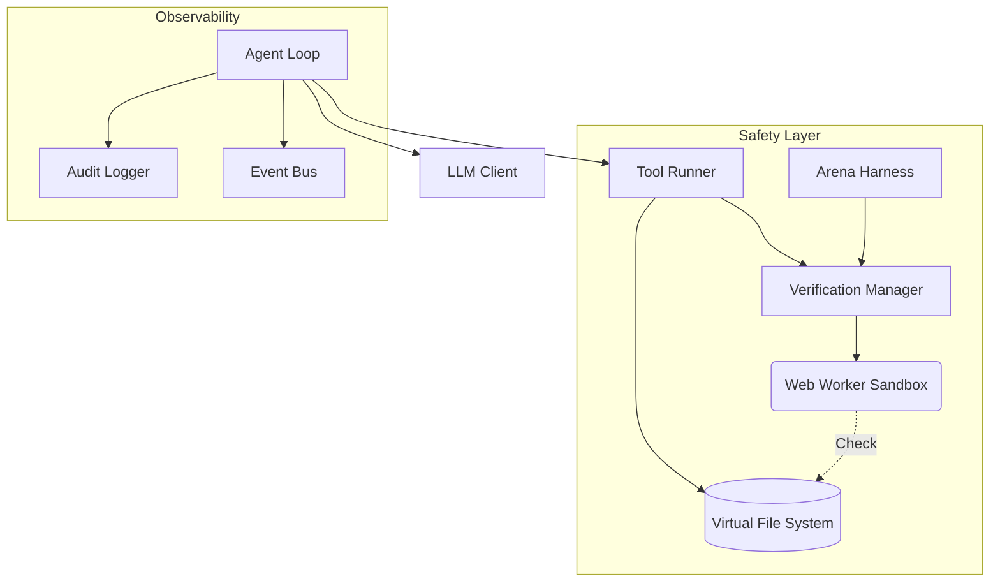

# REPLOID

**R**ecursive **E**volution **P**rotocol **L**oop **O**ptimizing **I**ntelligent **D**REAMER
**D**ynamic **R**ecursive **E**ngine **A**dapting **M**odules **E**volving **R**EPLOID
→ REPLOID ↔ DREAMER ↔ ∞

> Browser-native sandbox for safe AI agent development and research

A containment environment for AI agents that can write and execute code. Built for researchers, alignment engineers, and teams building autonomous systems who need **observability, rollback, and human oversight** — not black-box execution.

### Deployment Modes

| Mode | How to Run | Notes |
|------|------------|-------|
| **Fully local** | `npm install && npm run dev` | No network needed after hydration. Uses local models (Ollama, WebLLM). |
| **Hosted UI (https://replo.id)** | Open the site directly | Use WebLLM, cloud API keys, or connect to your local proxy. |
| **Hybrid** | Hosted UI + local proxy | Run `npm start` locally with CORS configured, then connect the hosted UI. |

In all modes, the agent runs in your browser. The proxy is only needed to access local model servers from the hosted UI or route cloud API calls through your machine.

---

## Why REPLOID?

AI agents that write code are powerful but dangerous. Most frameworks give agents unrestricted filesystem access, shell execution, or Docker root — then hope nothing goes wrong.

REPLOID takes a different approach: **everything runs in a browser sandbox** with transactional rollback, pre-flight verification, and human approval gates. The agent can modify its own tools, but every mutation is auditable and reversible.

**Use cases:**
- **AI safety research** — Study agent behavior in a contained environment
- **Model comparison** — Arena mode runs multiple LLMs against the same task, picks the best verified solution
- **Self-modification gating** — Test proposed code changes before committing them
- **Alignment prototyping** — Experiment with oversight patterns before deploying to production

## Architecture



### How It Works

The agent operates on a **Virtual File System (VFS)** backed by IndexedDB. It can read, write, and execute code — but only within the sandbox. All mutations pass through a verification layer that checks for syntax errors, dangerous patterns, and policy violations.

**Core execution loop:**
1. **Think** — Agent analyzes context and decides next action
2. **Act** — Tool call executed against VFS
3. **Observe** — Results captured and fed back to agent

**Key subsystems:**
- **Agent Loop** — Cognitive cycle with circuit breakers (default: 50 iterations max)
- **Virtual File System** — Browser-native filesystem on IndexedDB with snapshot/restore
- **LLM Client** — Multi-provider abstraction (WebLLM, Ollama, OpenAI, Anthropic, Google, Groq)
- **Worker Manager** — Multi-worker orchestration with permission tiers
- **Tool Runner** — Dynamic tool loading with arena gating for self-modifications
- **Verification Manager** — Pre-flight safety checks in isolated Web Worker

### Safety Mechanisms

1. **Genesis Snapshot** — Full VFS snapshot captured at boot, before any user action. Enables offline rollback to pristine state.

2. **Pre-flight Verification** — All code changes pass through isolated Web Worker. Catches syntax errors, infinite loops, `eval()`, and dangerous patterns before reaching VFS.

3. **Transactional Rollback** — VFS snapshots before mutations, restores on verification failure. No permanent damage from bad agent decisions.

4. **Arena Mode** — Test-driven selection for self-modifications. Multiple candidates compete, only verified solutions win.

5. **Circuit Breakers** — Rate limiting and iteration caps prevent runaway agents. Automatic recovery on failure.

6. **Audit Logging** — Every tool call, VFS mutation, and agent decision logged. Full replay capability.

7. **Service Worker Isolation** — All ES6 imports intercepted and served from VFS. Once hydrated, the agent runs entirely offline.

8. **Genesis Diff Visualization** — Color-coded comparison showing all changes from initial state (green=added, yellow=modified, red=deleted).

### Multi-Worker Orchestration

The system enables parallel task execution through permission-filtered subagents:

| Worker Type | Permissions | Use Case |
|-------------|-------------|----------|
| **explore** | Read-only | Codebase analysis |
| **analyze** | Read + JSON tools | Data processing |
| **execute** | Full tool access | Task execution |

Each worker can use a different model role (orchestrator, fast, code, local) for cost optimization. Workers run in a flat hierarchy (no nested spawning) and all actions flow through the audit pipeline.

### Tool System

All tools are **dynamically loaded** at boot. No hardcoded tools means full RSI capability: the agent can modify any tool, including core file operations.

**Tool categories:**
- **VFS Operations** — Read, write, list, delete files with audit logging
- **Meta-Tools (RSI)** — Create new tools at runtime, hot-reload modules
- **Worker Tools** — Spawn subagents, list/await workers
- **Utilities** — Grep, find, sed, jq, git (VFS-scoped shim)

All tools operate within the VFS sandbox with no access to host filesystem.

---

## Self-Modification Research

REPLOID is designed to study [recursive self-improvement](https://en.wikipedia.org/wiki/Recursive_self-improvement) (RSI) safely. The agent can modify its own code, but every change is verified, logged, and reversible.

### Modification Levels

| Level | Description | Safety Gate |
|-------|-------------|-------------|
| **L1: Tools** | Agent creates new tools at runtime | Verification Worker |
| **L2: Meta** | Agent improves its tool-creation mechanism | Arena Mode |
| **L3: Substrate** | Agent modifies core loop or memory | Human Approval (planned) |

**L1 Example:** Agent creates an "AddNumbers" tool, writes it to VFS, tests it, confirms it works.

**L2 Example:** Agent creates a "CreateToolFromDescription" tool that uses the LLM to generate code, then persists via the tool-creation mechanism. A tool that makes tools.

**L3 Example:** Agent reads its own core modules, identifies a bottleneck, writes an improved version, and hot-reloads it. Self-modification of core infrastructure.

---

## Comparison

| Capability | REPLOID | OpenHands | Claude Code | Devin |
|------------|---------|-----------|-------------|-------|
| **Execution** | Browser sandbox | Docker/Linux | Local shell | Cloud SaaS |
| **Rollback** | VFS snapshots | Container reset | git | N/A |
| **Offline rollback** | Yes (local IndexedDB) | No | No | No |
| **Verification** | Pre-flight checks | None | None | Unknown |
| **Self-modification** | Gated by arena | Unrestricted | N/A | N/A |
| **Offline capable** | Yes (WebLLM) | Yes | Yes | No |
| **Multi-model** | 6+ providers | Limited | Claude only | Unknown |
| **Subagents** | Worker tiers | N/A | Task tool | Unknown |

**REPLOID's niche:** Safe experimentation with self-modifying agents. Not the most powerful agent framework — the most observable and recoverable one.

---

## Why JavaScript?

REPLOID is pure JavaScript because the agent generates, modifies, and executes code at runtime — entirely in the browser. TypeScript requires compilation, but there's no build toolchain in-browser.

When the agent writes a new tool to the VFS, the Service Worker immediately serves it as an ES module. No compilation step, no latency. TypeScript would require bundling a 10MB+ compiler or maintaining separate source/artifact trees — defeating the self-modification model.

Runtime safety comes from verification (syntax checks, sandboxed execution, arena testing), not static types.

---

## Research Questions

REPLOID exists to study:

1. **Containment** — Can browser sandboxing provide meaningful safety guarantees for code-writing agents?
2. **Verification** — What static/dynamic checks catch dangerous mutations before execution?
3. **Selection** — Does arena-style competition improve agent outputs vs. single-model generation?
4. **Oversight** — What human-in-the-loop patterns balance safety with agent autonomy?

These are open questions. REPLOID is infrastructure for exploring them, not answers.

---

## Quick Start

```bash
git clone https://github.com/clocksmith/reploid
cd reploid/dreamer/reploid
npm install
npm run dev
# Open http://localhost:8080
```

### Genesis Levels

REPLOID offers 3 genesis configurations (selectable at boot):

| Level | Description |
|-------|-------------|
| **TABULA RASA** | Minimal agent core — fast boot, smallest surface |
| **REFLECTION** | + Self-awareness, streaming, verification, HITL |
| **FULL SUBSTRATE** | + Cognition, semantic memory, arena testing |

Select "FULL SUBSTRATE" for RSI experiments with maximum capability.

---

## License

MIT — Use freely, but read the safety warnings first.
