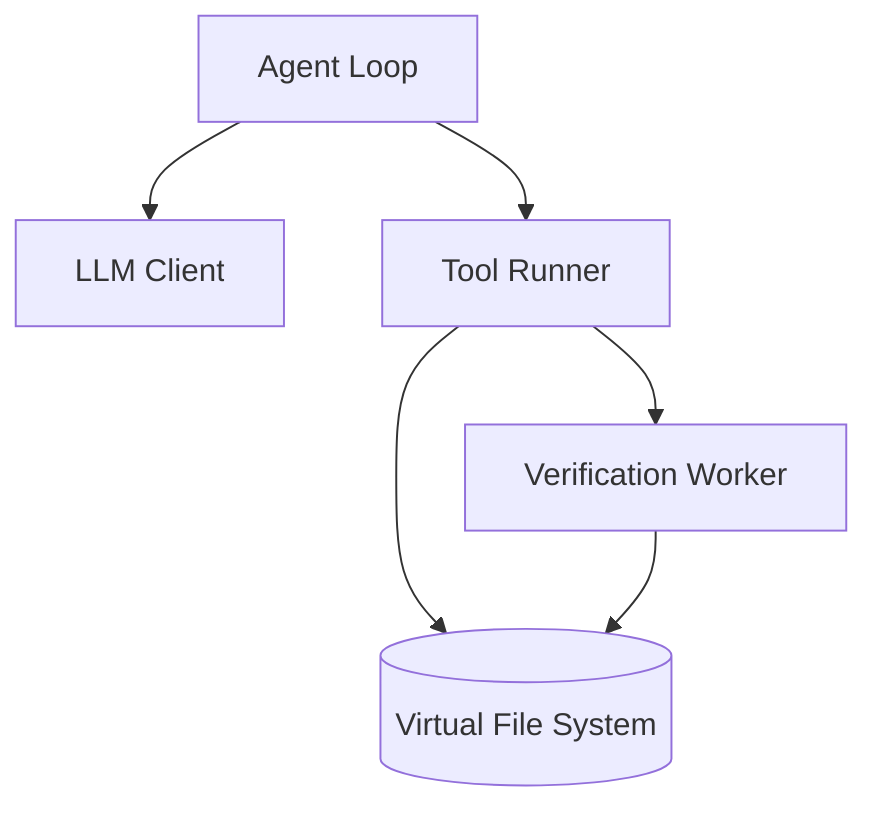

# REPLOID

```
REPLOID = Recursive Evolution Protocol Loop Optimizing Intelligent DREAMER
DREAMER = Dynamic Recursive Engine Adapting Modules Evolving REPLOID
→ REPLOID ↔ DREAMER ↔ ∞
```

> Browser-based AI agent sandbox

AI agent that runs entirely client-side. Uses IndexedDB as a virtual filesystem. Supports multiple LLM providers. Can create and modify its own tools at runtime.

## Quick Start

```bash
git clone https://github.com/clocksmith/reploid
cd reploid/dreamer/reploid
npm install
npm run dev
# Open http://localhost:8080
```

Or use the hosted version at https://replo.id

## How It Works



1. Agent receives a goal
2. LLM decides which tool to call
3. Tool executes against the VFS (IndexedDB)
4. Results feed back to agent
5. Repeat until done or iteration limit (default 50)

### Components

- **VFS** — Virtual filesystem in IndexedDB with snapshot/restore
- **LLM Client** — WebLLM, Ollama, OpenAI, Anthropic, Google, Groq
- **Tool Runner** — Loads tools from VFS, executes them
- **Verification Worker** — Syntax checks code before writing to VFS
- **Worker Manager** — Spawns subagents with permission tiers (read-only, read+json, full)

### Tools

Tools are JS modules in the VFS. The agent can:
- Use existing tools (ReadFile, WriteFile, Grep, etc.)
- Create new tools via CreateTool
- Modify existing tools (including CreateTool itself)

### Genesis Levels

Three boot configurations:

| Level | What's Loaded |
|-------|---------------|
| TABULA RASA | Minimal core |
| REFLECTION | + streaming, verification, HITL |
| FULL SUBSTRATE | + cognition, semantic memory, arena |

### Arena Mode

When the agent modifies tools, arena mode can run multiple candidate implementations and pick the one that passes tests.

## Why Browser-Based

- No Docker, no shell access, no filesystem access
- Runs offline after initial load (with WebLLM)
- VFS snapshots enable rollback
- Service Worker intercepts imports, serves from VFS

## Why JavaScript

The agent writes code that executes immediately. No compilation step. TypeScript would require bundling a compiler.

## License

MIT
