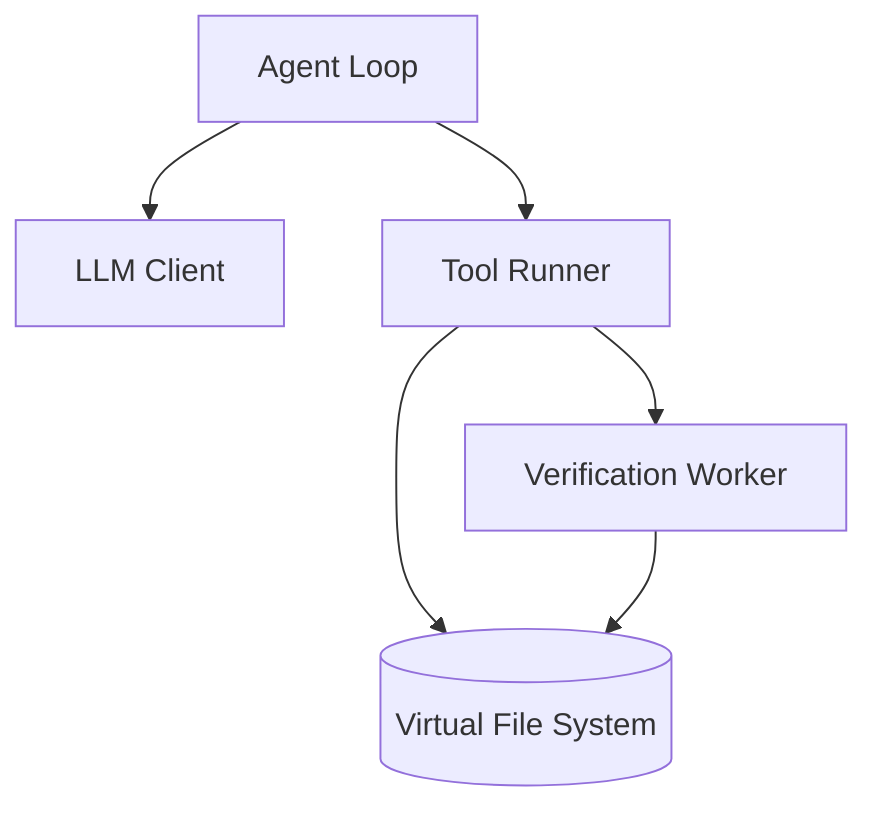

# REPLOID

```
REPLOID = Recursive Evolution Protocol Loop Optimizing Intelligent DREAMER
DREAMER = Dynamic Recursive Engine Adapting Modules Evolving REPLOID
→ REPLOID ↔ DREAMER ↔ ∞
```

> Browser-based AI agent sandbox

AI agent that runs entirely client-side. Uses IndexedDB as a virtual filesystem. Supports recursive self-improvement (RSI) — the agent can create, modify, and improve its own tools at runtime, including the tool-creation mechanism itself.

## Quick Start

```bash
git clone https://github.com/clocksmith/reploid
cd reploid/dreamer/reploid
npm install
npm run dev
# Open http://localhost:8080
```

Or use the hosted version at https://replo.id

## How It Works



1. Agent receives a goal
2. LLM decides which tool to call
3. Tool executes against the VFS (IndexedDB)
4. Results feed back to agent
5. Repeat until done or iteration limit (default 50)

### LLM Options

Designed for local-first use, but supports frontier models:

| Mode | Provider | Notes |
|------|----------|-------|
| Local (Browser) | WebLLM | Runs in browser via WebGPU, fully offline |
| Local (Browser) | Dreamer | .rpl format, GGUF import, Native Bridge |
| Local (Server) | Ollama, vLLM | Local server, connect via proxy |
| API | OpenAI, Anthropic, Google, Groq | Direct from client or via proxy |

The proxy (`npm start`) routes API calls through your machine for CORS and key management.

#### Local model choices: why each exists
- **WebLLM** (MLC, WebGPU): zero install, runs entirely in browser; great for privacy and offline use, but limited by browser memory/VRAM and slower kernels.
- **Transformers.js** (ONNX/WASM): widest browser compatibility and CPU/Metal paths; slower than WebGPU-first stacks but safest fallback when GPUs or WebGPU features are unavailable.
- **Dreamer** (.rpl + WebGPU + OPFS): built for medium/large models with sharded storage, hash verification, and multiple ingestion paths (serve CLI, in-browser GGUF import, native bridge). Higher performance and provenance guarantees, but requires conversion or the bridge install step.

### Components

- **VFS** — Virtual filesystem in IndexedDB with snapshot/restore
- **LLM Client** — Multi-provider abstraction
- **Tool Runner** — Loads tools from VFS, executes them
- **Verification Worker** — Syntax checks code before writing to VFS
- **Worker Manager** — Spawns subagents with permission tiers (read-only, read+json, full)

### Tools

Tools are JS modules in the VFS. The agent can:
- Use existing tools (ReadFile, WriteFile, Grep, etc.)
- Create new tools via CreateTool
- Modify existing tools (including CreateTool itself)

### Genesis Levels

Three boot configurations:

| Level | What's Loaded |
|-------|---------------|
| TABULA RASA | Minimal core |
| REFLECTION | + streaming, verification, HITL |
| FULL SUBSTRATE | + cognition, semantic memory, arena |

### Dreamer: Local Models in the Browser

Dreamer is the local WebGPU path for medium/large models. It uses the `.rpl` format (manifest + shard_*.bin) and supports three ways to load models:

1) Serve CLI (all browsers)
- `node dreamer/reploid/core/dreamer/tools/serve-cli.js /path/to/model.gguf`
- Converts GGUF → .rpl (temp dir) and serves with CORS (default http://localhost:8765).
- In the boot UI, pick provider “Dreamer” and paste the Model URL. Dreamer downloads into OPFS and caches it.

2) Import GGUF in-browser (Chrome/Edge)
- In the model form, choose “Dreamer” → click “Import GGUF from Disk”.
- Streams GGUF → .rpl directly into OPFS with progress UI. No CLI/server needed.

3) Native Bridge (extension + host, with browse modal)
- Load the Chrome extension from `core/dreamer/bridge/extension/` (dev mode).
- Run `core/dreamer/bridge/native/install.sh <extension-id>` to install the native host.
- In the model form, choose “Dreamer”; a Local Path field and browse button appear. Browse to a local `.rpl` directory; shards stream from disk with hash verification.

Notes:
- Manifests include tensor locations and shard hashes; `hashAlgorithm` may be `sha256` or `blake3`.
- Unified memory (Apple/Strix) is ideal for dense models; discrete GPUs benefit from MoE or smaller shards.

#### Dreamer troubleshooting & testing
- **Extension + host install:** Load the Chrome extension from `core/dreamer/bridge/extension/` (dev mode). Run `core/dreamer/bridge/native/install.sh <extension-id>` to register the native host.
- **Where models live:** Downloaded/imported `.rpl` shards live in browser storage (OPFS/IndexedDB). Clear via DevTools → Application → Storage → Clear site data to reclaim space.
- **Logs:** Open DevTools console for importer/bridge logs. For native host, check terminal output from `install.sh` and the host process (launched by the extension).
- **Connectivity tests:** `core/dreamer/bridge/native/test-host.js` exercises PING/READ/LIST; use it if the bridge isn’t responding.

### Recursive Self-Improvement (RSI)

The agent can modify its own code at three levels:

| Level | What | Example |
|-------|------|---------|
| L1: Tools | Create new tools | Agent writes an AddNumbers tool |
| L2: Meta | Improve tool-creation | Agent improves CreateTool to generate better code |
| L3: Substrate | Modify core loop | Agent rewrites its own execution logic |

All modifications are verified before execution and logged. VFS snapshots allow rollback if something breaks.

### Arena Mode

For L2+ modifications, arena mode generates multiple candidates, runs them against tests, and keeps the best one.

## Research Goals

**RSI Questions:**
- Can an agent improve its own tool-creation mechanism in a measurable way?
- What happens when the agent modifies its own prompt or system instructions?
- Can arena-style selection pressure produce better code than single-shot generation?

**Security/Containment:**
- Is browser sandboxing sufficient for code-writing agents?
- What verification checks actually catch dangerous mutations?
- Can we build meaningful human-in-the-loop gates without destroying agent autonomy?

**Current Limitation:** Small models that run locally via WebLLM (1-7B params) struggle with tool-use and code generation. For now, frontier models (Opus 4.5, GPT-5.1, Gemini 3) via API produce much better results. WebLLM/Dreamer become more useful as local models and hardware improve. Dense 70B on a discrete GPU will be bandwidth-bound; MoE or unified memory hardware is recommended.

## Why Browser-Based

- No Docker, no shell access, no filesystem access
- VFS snapshots enable rollback
- Service Worker intercepts imports, serves from VFS
- Designed for frontier API models, with WebLLM as fallback for offline/privacy use cases

## Why JavaScript

The agent writes code that executes immediately. No compilation step. TypeScript would require bundling a compiler.

## License

MIT
