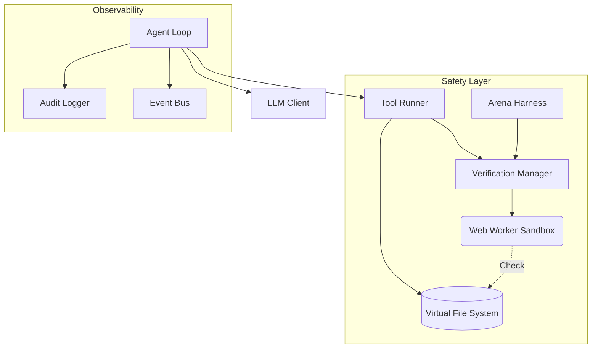

# REPLOID

> Browser-native sandbox for safe AI agent development and research

A containment environment for AI agents that can write and execute code. Built for researchers, alignment engineers, and teams building autonomous systems who need **observability, rollback, and human oversight** — not black-box execution.

### Deployment Modes

| Mode | How to Run | Notes |
|------|------------|-------|
| **Fully local** | `npm install && npm run dev` | No network needed after hydration. Uses local models (Ollama, WebLLM). |
| **Hosted UI (https://replo.id)** | Open the site directly | Use WebLLM, cloud API keys, or point the UI at your **local** proxy by enabling CORS on that proxy. |
| **Hybrid** | Hosted UI + local proxy | Run `npm start` locally, set `CORS_ORIGINS="https://replo.id,https://your-domain.example"` (or configure `server.corsOrigins`), then connect the hosted UI to `http://127.0.0.1:8000`. |

In all modes, the agent still runs in your browser. The proxy is only needed if you want to access local model servers (e.g., Ollama) from the hosted UI or route cloud API calls through your own machine.

---

See [TODO.md](TODO.md) for roadmap | [AGENTS.md](AGENTS.md) for agent profile

## Why REPLOID?

AI agents that write code are powerful but dangerous. Most frameworks give agents unrestricted filesystem access, shell execution, or Docker root — then hope nothing goes wrong.

REPLOID takes a different approach: **everything runs in a browser sandbox** with transactional rollback, pre-flight verification, and human approval gates. The agent can modify its own tools, but every mutation is auditable and reversible.

**Use cases:**
- **AI safety research** — Study agent behavior in a contained environment
- **Model comparison** — Arena mode runs multiple LLMs against the same task, picks the best verified solution
- **Self-modification gating** — Test proposed code changes before committing them
- **Alignment prototyping** — Experiment with oversight patterns before deploying to production

## How It Works

The agent operates on a Virtual File System (VFS) backed by IndexedDB. It can read, write, and execute code — but only within the sandbox. All mutations pass through a verification layer that checks for syntax errors, dangerous patterns, and policy violations.

## Architecture



### Safety First

1.  **Genesis Snapshot at Boot**: Full VFS snapshot captured immediately after hydration, before any user action. Enables offline rollback to pristine state—no network required for recovery.

2.  **Verification Manager**: All code changes pass through pre-flight checks in an isolated Web Worker. Catches syntax errors, infinite loops, `eval()`, and other dangerous patterns before they reach the VFS.

3.  **VFS Snapshots**: Transactional rollback. Capture state before mutations, restore if verification fails. No permanent damage from bad agent decisions.

4.  **Arena Mode**: Test-driven selection for self-modifications. Multiple candidates compete, only verified solutions win. Located in `/testing/arena/`.

5.  **Circuit Breakers**: Rate limiting and iteration caps (default: 50 cycles) prevent runaway agents. Automatic recovery on failure.

6.  **Audit Logging**: Every tool call, VFS mutation, and agent decision is logged. Full replay capability for debugging and analysis.

7.  **Service Worker Module Loader**: All ES6 imports intercepted and served from VFS (IndexedDB). Once hydrated, the agent runs entirely offline. Entry points (`boot.js`, `index.html`) stay on network for clean genesis boundaries.

8.  **Genesis Diff Visualization**: Color-coded comparison showing all changes from initial state (green = added, yellow = modified, red = deleted). Instant visibility into what the agent has modified.

### Core Components

| Component | Purpose |
|-----------|---------|
| `agent-loop.js` | Cognitive cycle (Think → Act → Observe) with circuit breakers |
| `vfs.js` | Browser-native filesystem on IndexedDB |
| `llm-client.js` | Multi-provider LLM abstraction (WebLLM, Ollama, Cloud APIs) |
| `worker-manager.js` | Multi-worker orchestration with permission tiers |
| `tool-runner.js` | Dynamic tool loading and execution with arena gating |
| `verification-manager.js` | Pre-flight safety checks in sandboxed worker |
| `persona-manager.js` | System prompt customization per genesis level |
| `arena-harness.js` | Competitive selection for code changes |

### Proto UI

The Proto interface (`ui/proto.js`) provides full observability:

| Tab | Purpose |
|-----|---------|
| **History** | LLM responses, tool calls, streaming output |
| **Reflections** | Agent learning entries with success/error status |
| **Status** | Agent state, token usage, error log |
| **Workers** | Active/completed workers, per-worker logs |
| **Debug** | System prompt, conversation context, model config |

Additional features: VFS browser with diff/preview, command palette (Ctrl+K), Genesis snapshot management.

### Multi-Worker Orchestration

The WorkerManager enables parallel task execution through permission-filtered subagents:

| Worker Type | Permissions | Use Case |
|-------------|-------------|----------|
| **explore** | Read-only (ReadFile, ListFiles, Grep, Find) | Codebase analysis |
| **analyze** | Read + JSON tools | Data processing |
| **execute** | Full tool access | Task execution |

**Model Roles:** Each worker can use a different model role (orchestrator, fast, code, local) for cost optimization.

**Worker Tools:**
- `SpawnWorker` — Create a new worker with type, task, and optional model role
- `ListWorkers` — View active and completed workers
- `AwaitWorkers` — Wait for specific workers or all to complete

Workers run in a flat hierarchy (no worker can spawn workers) and all actions flow through the same audit pipeline.

### Available Tools

**All tools are dynamic** — loaded from `/tools/` at boot. No hardcoded tools means full RSI capability: the agent can modify any tool, including core file operations. All tool names use CamelCase (e.g., ReadFile, Grep, CreateTool) to keep the interface consistent.

**Core VFS Operations:**
- `ReadFile`, `WriteFile`, `ListFiles`, `DeleteFile` — VFS operations with audit logging

**Meta-Tools (RSI):**
- `CreateTool` — Dynamic tool creation at runtime (L1 RSI)
- `LoadModule` — Hot-reload modules from VFS
- `ListTools` — Discover available tools
- `Edit` — Apply literal match/replacement edits to files

**Worker Tools:**
- `SpawnWorker` — Spawn permission-filtered subagent
- `ListWorkers` — List active/completed workers
- `AwaitWorkers` — Wait for worker completion

**Utilities:**
- `FileOutline` — Analyze file structure without reading content
- `Cat`, `Head`, `Tail`, `Ls`, `Pwd`, `Touch` — Familiar filesystem navigation primitives
- `Grep`, `Find`, `Sed`, `Jq` — Search, filter, and transform file contents
- `Git` — Version control operations (VFS-scoped shim)
- `Mkdir`, `Rm`, `Mv`, `Cp` — File management

All tools operate within the VFS sandbox with no access to host filesystem. Tools receive a `deps` object with VFS, EventBus, ToolWriter, WorkerManager, and other modules for full capability.

---

## Why JavaScript, Not TypeScript?

REPLOID is pure JavaScript because the agent generates, modifies, and executes code at runtime—entirely in the browser. TypeScript requires compilation, but there's no Node.js or build toolchain in-browser.

When the agent writes a new tool to the VFS, the Service Worker immediately serves it as an ES module. No compilation step, no latency. TypeScript would require bundling a 10MB+ compiler or maintaining separate source/artifact trees—defeating the self-modification model.

Runtime safety comes from verification (syntax checks, sandboxed execution, arena testing), not static types. The `[SW]` logs show this: modules loading from VFS, no build step.

---

## Self-Modification Research

REPLOID is designed to study [recursive self-improvement](https://en.wikipedia.org/wiki/Recursive_self-improvement) (RSI) safely. The agent can modify its own code, but every change is verified, logged, and reversible.

### Modification Levels

| Level | Description | Safety Gate |
|-------|-------------|-------------|
| **L1: Tools** | Agent creates new tools at runtime | Verification Worker |
| **L2: Meta** | Agent improves its tool-creation mechanism | Arena Mode |
| **L3: Substrate** | Agent modifies core loop or memory | Human Approval (planned) |

### Example: Tool Creation (L1)
**Goal:** "Create a tool that adds two numbers"

```
[Agent] Iteration 1: Analyzing goal...
[Agent] I need a tool to add numbers
[TOOL_CALL] CreateTool
[ARGS] {
  name: "AddNumbers",
  code: "export default async function({a, b}) { return a + b; }"
}
[TOOL_RESULT] ✓ Tool created: /tools/AddNumbers.js
[Agent] Testing new tool...
[TOOL_CALL] AddNumbers
[ARGS] {a: 5, b: 3}
[TOOL_RESULT] 8
[Agent] ✓ Goal complete
```

### Example: Meta-Tool Creation (L2)
**Goal:** "Build a system that creates tools from descriptions"

Agent creates `CreateToolFromDescription` which calls the LLM to generate code, then calls `CreateTool` to persist it. A tool that makes tools.

### Example: Substrate Modification (L3)
**Goal:** "Optimize your tool creation process"

Agent reads `/core/tool-writer.js`, identifies a bottleneck, writes an improved version with `WriteFile`, and hot-reloads via `LoadModule`. Self-modification of core infrastructure.

---

## Comparison

| Capability | REPLOID | OpenHands | Claude Code | Devin |
|------------|---------|-----------|-------------|-------|
| **Execution** | Browser sandbox | Docker/Linux | Local shell | Cloud SaaS |
| **Rollback** | VFS snapshots | Container reset | git | N/A |
| **Offline rollback** | Yes (local IndexedDB) | No | No | No |
| **Verification** | Pre-flight checks | None | None | Unknown |
| **Self-modification** | Gated by arena | Unrestricted | N/A | N/A |
| **Offline capable** | Yes (WebLLM) | Yes | Yes | No |
| **Multi-model** | 6+ providers | Limited | Claude only | Unknown |
| **Subagents** | Worker tiers | N/A | Task tool | Unknown |
| **Inspectable** | Full source | Full source | Partial | Closed |

**REPLOID's niche:** Safe experimentation with self-modifying agents. Not the most powerful agent framework — the most observable and recoverable one. Unique advantages: multi-model orchestration, browser-native local models (WebLLM), and permission-tiered worker subagents.

---

## Research Questions

REPLOID exists to study:

1. **Containment** — Can browser sandboxing provide meaningful safety guarantees for code-writing agents?
2. **Verification** — What static/dynamic checks catch dangerous mutations before execution?
3. **Selection** — Does arena-style competition improve agent outputs vs. single-model generation?
4. **Oversight** — What human-in-the-loop patterns balance safety with agent autonomy?

These are open questions. REPLOID is infrastructure for exploring them, not answers.

---

## Quick Start

```bash
git clone https://github.com/clocksmith/reploid
cd reploid
npm install
npm run dev
# Open http://localhost:8080
```

### Genesis Levels

REPLOID offers 3 genesis configurations (selectable at boot):

| Level | Modules | Description |
|-------|---------|-------------|
| **TABULA RASA** | 13 | Minimal agent core — fast boot, smallest surface |
| **REFLECTION** | 19 | + Self-awareness, streaming, verification, HITL |
| **FULL SUBSTRATE** | 32 | + Cognition, semantic memory, arena testing |

Select "FULL SUBSTRATE" for RSI experiments with maximum capability.

**Example Goals:**
- "Create a recursive tool chain: a tool that builds tools that enhance tools"
- "Analyze your source code in /core and identify bottlenecks"
- "Build a tool that generates test cases from function signatures"

The VFS Explorer (right panel) provides:
- **Preview (▶)** - Execute HTML/CSS/JS files in sandboxed iframe
- **Diff (⊟)** - Compare current VFS to genesis state
- **Snapshots (◷)** - Timeline of all saved states with restore capability

---

## License

MIT — Use freely, but read the safety warnings first.
