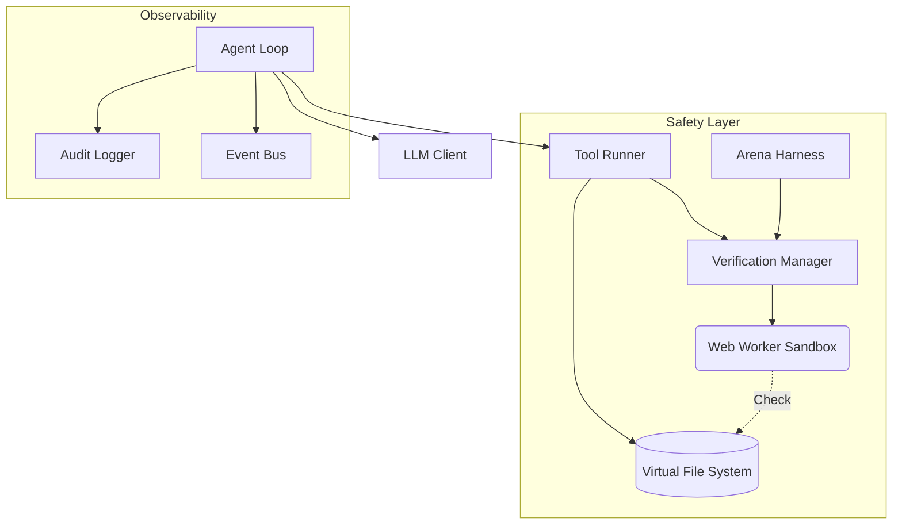

# REPLOID

> Browser-native sandbox for safe AI agent development and research

A containment environment for AI agents that can write and execute code. Built for researchers, alignment engineers, and teams building autonomous systems who need **observability, rollback, and human oversight** — not black-box execution.

---

See [TODO.md](TODO.md) for roadmap | [AGENTS.md](AGENTS.md) for agent profile

## Why REPLOID?

AI agents that write code are powerful but dangerous. Most frameworks give agents unrestricted filesystem access, shell execution, or Docker root — then hope nothing goes wrong.

REPLOID takes a different approach: **everything runs in a browser sandbox** with transactional rollback, pre-flight verification, and human approval gates. The agent can modify its own tools, but every mutation is auditable and reversible.

**Use cases:**
- **AI safety research** — Study agent behavior in a contained environment
- **Model comparison** — Arena mode runs multiple LLMs against the same task, picks the best verified solution
- **Self-modification gating** — Test proposed code changes before committing them
- **Alignment prototyping** — Experiment with oversight patterns before deploying to production

## How It Works

The agent operates on a Virtual File System (VFS) backed by IndexedDB. It can read, write, and execute code — but only within the sandbox. All mutations pass through a verification layer that checks for syntax errors, dangerous patterns, and policy violations.

## Architecture



### Safety First

1.  **Verification Manager**: All code changes pass through pre-flight checks in an isolated Web Worker. Catches syntax errors, infinite loops, `eval()`, and other dangerous patterns before they reach the VFS.

2.  **VFS Snapshots**: Transactional rollback. Capture state before mutations, restore if verification fails. No permanent damage from bad agent decisions.

3.  **Arena Mode**: Test-driven selection for self-modifications. Multiple candidates compete, only verified solutions win. Located in `/testing/arena/`.

4.  **Circuit Breakers**: Rate limiting and iteration caps (default: 50 cycles) prevent runaway agents. Automatic recovery on failure.

5.  **Audit Logging**: Every tool call, VFS mutation, and agent decision is logged. Full replay capability for debugging and analysis.

### Core Components

| Component | Purpose |
|-----------|---------|
| `agent-loop.js` | Cognitive cycle (Think → Act → Observe) with circuit breakers |
| `vfs.js` | Browser-native filesystem on IndexedDB |
| `llm-client.js` | Multi-provider LLM abstraction (WebLLM, Ollama, Cloud APIs) |
| `verification-manager.js` | Pre-flight safety checks in sandboxed worker |
| `arena-harness.js` | Competitive selection for code changes |

---

## Self-Modification Research

REPLOID is designed to study [recursive self-improvement](https://en.wikipedia.org/wiki/Recursive_self-improvement) (RSI) safely. The agent can modify its own code, but every change is verified, logged, and reversible.

### Modification Levels

| Level | Description | Safety Gate |
|-------|-------------|-------------|
| **L1: Tools** | Agent creates new tools at runtime | Verification Worker |
| **L2: Meta** | Agent improves its tool-creation mechanism | Arena Mode |
| **L3: Substrate** | Agent modifies core loop or memory | Human Approval (planned) |

### Example: Tool Creation (L1)
**Goal:** "Create a tool that adds two numbers"

```
[Agent] Iteration 1: Analyzing goal...
[Agent] I need a tool to add numbers
[TOOL_CALL] create_tool
[ARGS] {
  name: "add_numbers",
  code: "export default async function({a, b}) { return a + b; }"
}
[TOOL_RESULT] ✓ Tool created: /tools/add_numbers.js
[Agent] Testing new tool...
[TOOL_CALL] add_numbers
[ARGS] {a: 5, b: 3}
[TOOL_RESULT] 8
[Agent] ✓ Goal complete
```

### Example: Meta-Tool Creation (L2)
**Goal:** "Build a system that creates tools from descriptions"

```
[Agent] Iteration 1: I need a meta-tool
[TOOL_CALL] create_tool
[ARGS] {
  name: "create_tool_from_description",
  code: `export default async function({description}) {
    // Call LLM to generate code from description
    const code = await call_llm({
      prompt: "Generate JavaScript function: " + description
    });

    // Create the tool
    const toolName = description.split(' ')[0].toLowerCase();
    await executeTool('create_tool', {name: toolName, code});
    return {success: true, tool: toolName};
  }`
}
[TOOL_RESULT] ✓ Meta-tool created
[Agent] Iteration 2: Testing meta-tool...
[TOOL_CALL] create_tool_from_description
[ARGS] {description: "Parse JSON and extract errors"}
[TOOL_RESULT] ✓ Created tool: parse
[Agent] I just created a tool-creating tool! (Level 2 RSI)
```

### Example: Substrate Modification (L3)
**Goal:** "Analyze your tool creation process and optimize it"

```
[Agent] Iteration 1: Reading my own tool-writer...
[TOOL_CALL] read_file
[ARGS] {path: "/core/tool-writer.js"}
[TOOL_RESULT] [1200 lines of code]
[Agent] I see the bottleneck: validation runs on every call
[Agent] Iteration 2: Improving myself...
[TOOL_CALL] improve_core_module
[ARGS] {
  module: "tool-writer",
  code: "... version with AST caching ..."
}
[TOOL_RESULT] ✓ Backed up /core/tool-writer.js.backup.1763000000
[TOOL_RESULT] ✓ Module hot-reloaded
[Agent] Iteration 3: Testing improvement...
[TOOL_CALL] create_tool
[ARGS] {name: "test_tool", code: "..."}
[TOOL_RESULT] ✓ Created in 0.3s (was 2.1s before)
[Agent] I just made myself faster! (Level 3 RSI)
```

---

## Comparison

| Capability | REPLOID | OpenHands | Claude Code | Devin |
|------------|---------|-----------|-------------|-------|
| **Execution** | Browser sandbox | Docker/Linux | Local shell | Cloud SaaS |
| **Rollback** | VFS snapshots | Container reset | Git | N/A |
| **Verification** | Pre-flight checks | None | None | Unknown |
| **Self-modification** | Gated by arena | Unrestricted | N/A | N/A |
| **Offline capable** | Yes (WebLLM) | Yes | Yes | No |
| **Inspectable** | Full source | Full source | Partial | Closed |

**REPLOID's niche:** Safe experimentation with self-modifying agents. Not the most powerful agent framework — the most observable and recoverable one.

---

## Research Questions

REPLOID exists to study:

1. **Containment** — Can browser sandboxing provide meaningful safety guarantees for code-writing agents?
2. **Verification** — What static/dynamic checks catch dangerous mutations before execution?
3. **Selection** — Does arena-style competition improve agent outputs vs. single-model generation?
4. **Oversight** — What human-in-the-loop patterns balance safety with agent autonomy?

These are open questions. REPLOID is infrastructure for exploring them, not answers.

---

## Quick Start

```bash
git clone https://github.com/clocksmith/reploid
cd reploid
npm install
npm start
# Open http://localhost:3000
```

Select a model, enter a goal, click "Awaken Agent."

---

## License

MIT — Use freely, but read the safety warnings first.
