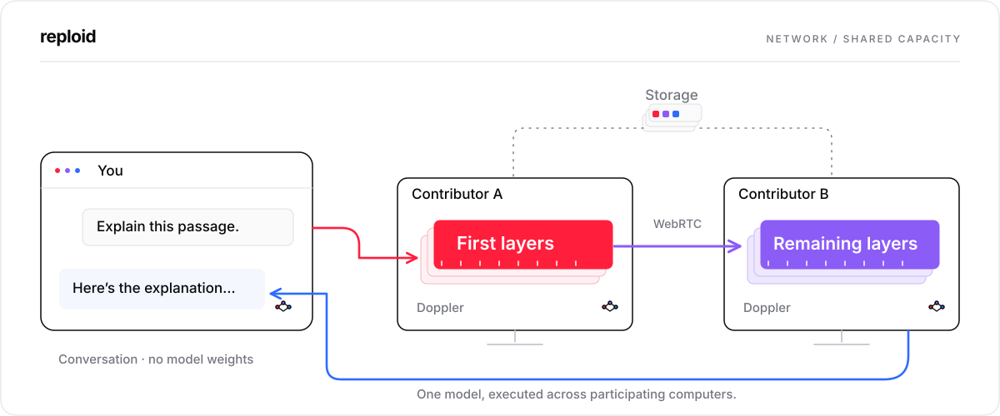
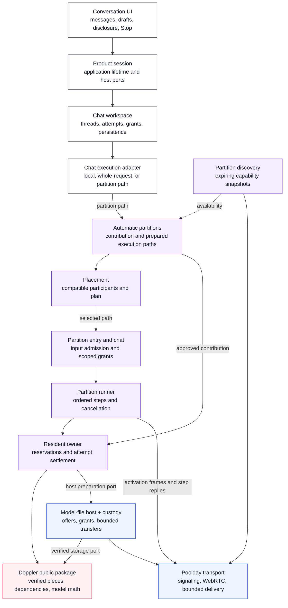
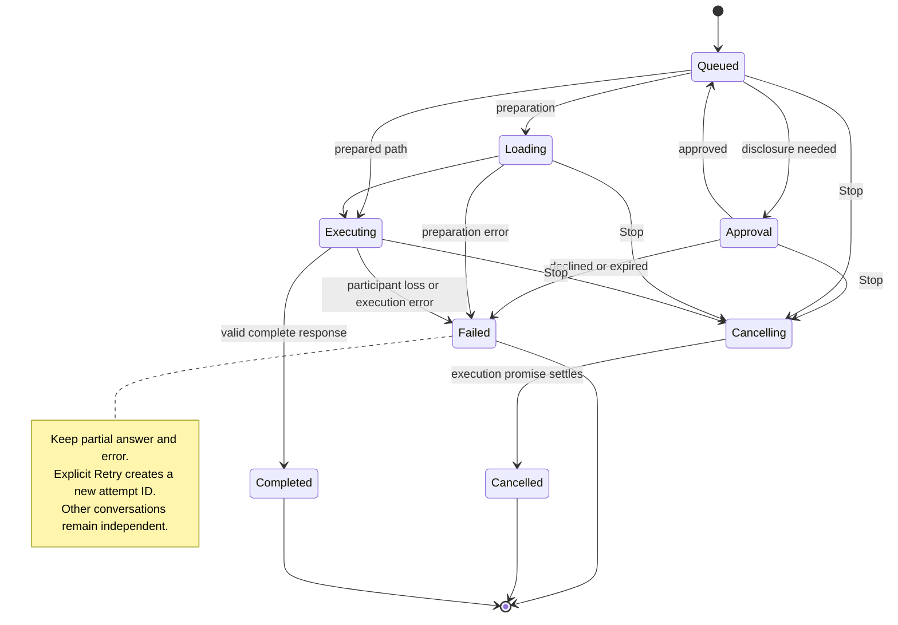

# Reploid

[](https://github.com/clocksmith/reploid/actions/workflows/test.yml)
[](LICENSE)

Reploid lets people and agents use intelligence beyond one device’s capacity.
Participating computers share verified model pieces and execute complementary
parts of one model; cooperating agents contribute tools and approaches. Chat is
the first interface to this network. Each participant controls its contribution
and disclosure. These are product goals; qualification is recorded separately.

<picture>
  <source media="(max-width: 640px)" srcset="docs/diagrams/readme-architecture-mobile.svg" />
  
</picture>

The diagram illustrates partitioned execution; model availability, disclosure
permissions, and qualified peers determine which requests can run. Reploid
coordinates work; Doppler owns model computation; Poolday connects participants.
[Technical diagrams: components and recovery](#technical-architecture).

**[Try Reploid](https://replo.id/)** · [Run locally](#how-to-use-reploid)

Open a conversation and choose an available model. Local inference needs WebGPU
and model files; peer execution needs another eligible, connected participant.

Zero is its minimal starting configuration; X extends Zero with explicit
capabilities and supporting blueprints. Poolday supplies optional discovery,
artifact exchange, bounded peer computation, recovery, and reusable experience.
Evaluation, approval, and activation are separately authorized roles.
Change Passport remains an inactive alternative; Research Room-1 is an optional
scientific workflow with its own evidence and admission requirements.

## Who uses it

Repository mission, value, and durable strategy live in [GOALS.md](GOALS.md).
Poolday's user workflow and evidence boundary live in its
[product intent](docs/poolday/product-intent.md).

The repository serves:

- Humans and agents pursuing bounded goals through authorized tools and models.
- Experimenters testing capability acquisition and recursive improvement in Zero or X.
- Public protein catalog curators testing a disputed family or domain annotation.
- Research Room requesters, compute contributors, and accountable reviewers.
- Runtime and product contributors working on browser execution and room state.
- Security and claim reviewers checking records, relay boundaries, and evidence.
- Researchers designing the future active-science workflow.

## How to use Reploid

Install and start the local browser surface:

```bash
npm install
npm start
```

Open `http://localhost:8000`, or use [replo.id](https://replo.id/).

1. Start a conversation and select an available model. Discovery runs through the
   configured public mesh; public participation requires no invitation, room setup
   or manual computer selection.
2. Ask a question. Before remote execution, review the actual recipients and
   disclosure scope. Declining keeps the conversation usable.
3. Receive the answer in that conversation. A prepared peer path requires no
   requester weight downloads. If no eligible path is ready, the model remains
   unavailable; downloading weights to run on this device is a separate choice.
4. Start other conversations independently. Stop affects its identified attempt.
   After an interruption, keep the partial answer and explicitly retry in a new
   attempt; do not assume GPU continuation state survives.
5. Optionally contribute storage or compute with explicit limits. Contribution
   preparation is separate from using capacity already prepared by other peers.

See the [network quick start](docs/QUICK-START.md) and
[current partition handoff](docs/doppler-partition-handoff.md#current-checkout-and-evidence).
Partition execution is implemented; complete numerical and application
qualification remains open. Evaluated tool improvement is a distinct workflow,
with independent evaluation and operator adoption rather than automatic mutation.

The product surface is:

| Surface | Route | Use |
| --- | --- | --- |
| [Reploid](docs/poolday/product-intent.md) | `/` | Agents, models, shared tasks, contribution, and tested improvements together. |
| Zero | `/zero` | Minimal self-loading configuration for problem-solving and improvement experiments. |
| X | `/x` | Zero with prepared executable extensions and supporting blueprints. |

Poolday is an internal name for optional peer infrastructure, not a separate
public product. Zero's current inference default is the server proxy, with
optional local Doppler execution; a browser agent does not imply offline inference.
Cloud-provider and substrate setup belongs to the [Zero/X compatibility guide](docs/zero-x-quick-start.md).
Private invitations and evaluated tool changes belong to the scoped
[collaboration workflow](docs/work-collaboration.md). Existing signed `Pack`
protocols retain their own catalog and verification rules; they are not another
name for every current Doppler artifact.

## Technical architecture

These views trace source at `1c8860f4`. They describe the ordinary distributed
conversation, not a qualification result. See the
[architecture guide](docs/open-mesh-architecture.md#technical-diagrams) for source owners and details.

### Component ownership

Solid arrows show calls or data flow; dotted arrows supply observations.
Discovery, contribution, custody and input disclosure retain separate grants.


```mermaid
flowchart TB
    UI["Conversation UI<br/>messages, drafts, disclosure, Stop"]
    HOST["Product session<br/>application lifetime and host ports"]
    CHAT["Chat workspace<br/>threads, attempts, grants, persistence"]
    EXEC["Chat execution adapter<br/>local, whole-request, or partition path"]
    AUTO["Automatic partitions<br/>contribution and prepared execution paths"]
    DISC["Partition discovery<br/>expiring capability snapshots"]
    PLACE["Placement<br/>compatible participants and plan"]
    INPUT["Partition entry and chat<br/>input admission and scoped grants"]
    RUN["Partition runner<br/>ordered steps and cancellation"]
    RES["Resident owner<br/>reservations and attempt settlement"]
    FILES["Model-file host + custody<br/>offers, grants, bounded transfers"]
    DOP["Doppler public package<br/>verified pieces, dependencies, model math"]
    NET["Poolday transport<br/>signaling, WebRTC, bounded delivery"]
    UI --> HOST --> CHAT --> EXEC
    EXEC -->|partition path| AUTO
    DISC -.->|availability| AUTO
    AUTO --> PLACE
    PLACE -->|selected path| INPUT
    INPUT --> RUN --> RES --> DOP
    AUTO -->|approved contribution| RES
    RES -->|host preparation port| FILES
    FILES -->|verified storage port| DOP
    DISC --> NET
    FILES --> NET
    RUN -->|activation frames and step replies| NET
    classDef app fill:#ffffff,stroke:#111827,color:#111827
    classDef mesh fill:#f3edff,stroke:#7c3aed,color:#111827
    classDef data fill:#edf3ff,stroke:#2563eb,color:#111827
    classDef compute fill:#fff0f3,stroke:#e11d48,color:#111827
    class UI,HOST,CHAT,EXEC app
    class AUTO,DISC,PLACE,INPUT,RUN,RES mesh
    class FILES,NET data
    class DOP compute
```

### Attempt failure and recovery

Retry creates a new attempt. Partial output survives failure; other conversations
remain independent, and connection loss does not prove remote GPU completion.


```mermaid
stateDiagram-v2
    [*] --> Queued
    Queued --> Approval: disclosure needed
    Approval --> Queued: approved
    Approval --> Failed: declined or expired
    Queued --> Loading: preparation
    Queued --> Executing: prepared path
    Loading --> Executing
    Loading --> Failed: preparation error
    Executing --> Completed: valid complete response
    Executing --> Failed: participant loss or execution error
    Approval --> Cancelling: Stop
    Queued --> Cancelling: Stop
    Loading --> Cancelling: Stop
    Executing --> Cancelling: Stop
    Cancelling --> Cancelled: execution promise settles
    Failed --> [*]
    Cancelled --> [*]
    Completed --> [*]
    note right of Failed
        Keep partial answer and error.
        Explicit Retry creates a new attempt ID.
        Other conversations remain independent.
    end note
```

## Evidence and current surfaces

The [surface claim index](docs/status/surface-claim-index.json) owns the current
support claims and their evidence paths.

| Claim row | Current boundary |
| --- | --- |
| `local-execution` | A configured local executor runs slots in the current browser. |
| `peer-slot-placement` | Opted-in slots may run on joined peers; joining does not expose local inference without a local executor. |
| `browser-provider-roles` | Requesters and providers exchange assignments, outputs, and receipts through peer rooms. |
| `signaling` | Same-browser rooms can use `BroadcastChannel`; cross-host WebRTC uses signaling for rendezvous. |
| `sealed-credentials` | `npm start` can build sealed access windows; client artifacts omit the plaintext key. |
| `public-mesh` | Blocked as a signaling-free claim while cross-host rendezvous requires signaling. |

The peer-execution path provides receipt-backed browser inference. Its claimed
local model execution and browser agent state stay in the browser; explicitly
selected cloud providers have their own execution boundary. Services may handle
authentication, rendezvous, policy enforcement, receipt anchors, and ledger
projections; they do not perform the claimed browser-local model execution.
The current enabled scientific peer catalog covers public protein inputs and
the pinned ESM-2 contract; that scope does not define every Reploid task.

## Limits and status

Reploid does not claim hardware attestation, independently trustworthy
browser/GPU execution, or guaranteed honest providers. Relay acknowledgement proves receipt of a relay
record, not execution truth. Capability claims require their declared evidence;
ordinary networking and experimental use do not establish improvement. Learned
routing and scientific-policy promotion retain their specific admission gates.
Read the claim index row before repeating a capability statement.

## Repository map

- [`packages/reploid/`](packages/reploid/): reusable chat, mesh, transport, custody and agent implementation
- [`self/host/`](self/host/): browser service composition, storage and runtime ports
- [`self/ui/`](self/ui/): presentation and actions backed by package-owned state
- [`self/`](self/): browser boot profiles and Zero/X substrate, VFS and tools
- [`docs/`](docs/): product intent, claims, security, architecture, and operator guides
- [`deploy/`](deploy/): deployment and access-window tooling
- [`doppler/`](doppler/): vendored or paired Doppler integration surface
- [`examples/showcase/`](examples/showcase/): demonstrations and recorded runs
- [`package.json`](package.json): package metadata and local commands

## Intent and component authority

- [GOALS.md](GOALS.md) owns the repository mission, value, and durable strategic goals.
- [CATSCAN.md](CATSCAN.md) is the root component charter. Child charters narrow its authority for independently meaningful components.
- The generated [component index](docs/component-index.md) lists every charter, parent, and target.
- [AGENTS.md](AGENTS.md) defines how code agents discover and obey the charter chain.
- The [workspace CATSCAN protocol](https://github.com/clocksmith/ouroboros/blob/main/deco/docs/catscan.md) defines the shared shape and precedence rules.

Run `npm run catscan:chain -- <path>` to print the charter chain for a target file. Run `npm run verify:catscan` to validate fields, parents, links, evidence paths, identifiers, size, and the generated index.

## Read next

- [Repository goals](GOALS.md)
- [Root component charter](CATSCAN.md)
- [Component index](docs/component-index.md)
- [Documentation index](docs/INDEX.md)
- [Poolday product intent](docs/poolday/product-intent.md)
- [Discovery Contract](docs/poolday/discovery-contract.md)
- [Poolday claims and non-claims](docs/poolday/claims-and-nonclaims.md)
- [Security model](docs/SECURITY.md)
- [RSI improvement episodes](docs/rsi-improvement-episodes.md)
- [Doppler](https://github.com/clocksmith/doppler)

## License

[MIT License](LICENSE). The package metadata also declares `MIT`.
