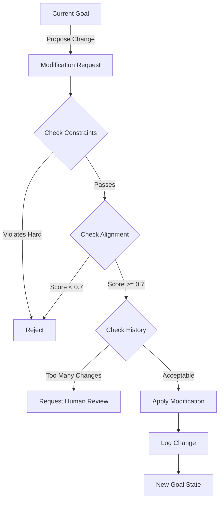

# Blueprint 0x000017: Safe Goal Modification Patterns

**Objective:** To establish principles and mechanisms for the agent to safely modify its own goals without losing alignment or coherence.

**Target Upgrade:** GMOD (`goal-modifier.js`)

**Prerequisites:** `0x000005` (State Management), `0x000008` (Cognitive Cycle), **0x00004E** (Module Widget Protocol)

**Affected Artifacts:** `/system/state.json`, `/modules/agent-cycle.js`

---

### 1. The Goal Modification Paradox

An agent that can modify its own goals has ultimate flexibility but risks losing its purpose. The challenge is enabling goal evolution while maintaining alignment with the original intent. This requires careful constraints and verification mechanisms.

### 2. Goal Structure Architecture

**Hierarchical Goal System:**
```json
{
  "currentGoal": {
    "seed": "Original human-provided goal",
    "cumulative": "Current working goal with refinements",
    "stack": [
      { "goal": "Main objective", "priority": 1, "parent": null },
      { "goal": "Subgoal 1", "priority": 2, "parent": 0 },
      { "goal": "Subgoal 1.1", "priority": 3, "parent": 1 }
    ],
    "constraints": [
      "Must maintain original intent",
      "Cannot violate safety rules",
      "Must be measurable"
    ],
    "metadata": {
      "created_cycle": 0,
      "last_modified": 42,
      "modification_count": 3,
      "alignment_score": 0.95
    }
  }
}
```

### 3. Safe Modification Patterns

**Pattern 1: Goal Refinement (Safe)**
```javascript
// Clarifying or specifying the existing goal
const refineGoal = (currentGoal, refinement) => {
  return {
    ...currentGoal,
    cumulative: `${currentGoal.cumulative}\nRefined: ${refinement}`,
    metadata: {
      ...currentGoal.metadata,
      last_modified: currentCycle,
      modification_count: currentGoal.metadata.modification_count + 1
    }
  };
};
```

**Pattern 2: Subgoal Addition (Safe)**
```javascript
// Adding subgoals that serve the main goal
const addSubgoal = (currentGoal, subgoal) => {
  // Verify subgoal serves parent
  const alignmentCheck = evaluateAlignment(subgoal, currentGoal.seed);
  if (alignmentCheck.score < 0.7) {
    throw new Error("Subgoal not aligned with original intent");
  }
  
  currentGoal.stack.push({
    goal: subgoal,
    priority: currentGoal.stack.length + 1,
    parent: 0,
    alignment: alignmentCheck
  });
  return currentGoal;
};
```

**Pattern 3: Goal Pivoting (Requires Verification)**
```javascript
// Changing direction while maintaining intent
const pivotGoal = async (currentGoal, newDirection, reason) => {
  // 1. Check alignment with seed goal
  const alignment = await evaluateAlignment(newDirection, currentGoal.seed);
  
  // 2. Require high confidence
  if (alignment.score < 0.8) {
    return { error: "New direction not sufficiently aligned", alignment };
  }
  
  // 3. Log the pivot
  await logGoalModification({
    type: 'pivot',
    from: currentGoal.cumulative,
    to: newDirection,
    reason: reason,
    cycle: currentCycle
  });
  
  // 4. Update with traceback
  return {
    ...currentGoal,
    cumulative: newDirection,
    stack: [...currentGoal.stack, {
      goal: newDirection,
      priority: 1,
      parent: null,
      pivot_from: currentGoal.cumulative,
      reason: reason
    }]
  };
};
```

### 4. Goal Modification Constraints

**Hard Constraints (Cannot be overridden):**
```javascript
const IMMUTABLE_CONSTRAINTS = [
  "Cannot modify seed goal",
  "Cannot remove safety checks",
  "Cannot disable logging",
  "Must maintain goal history"
];
```

**Soft Constraints (Require justification):**
```javascript
const SOFT_CONSTRAINTS = [
  "Should align with seed goal (>70%)",
  "Should be measurable",
  "Should have success criteria",
  "Should have time bounds"
];
```

### 5. Alignment Verification

```javascript
const evaluateAlignment = async (newGoal, seedGoal) => {
  // Use LLM to evaluate alignment
  const prompt = `
    Original Goal: ${seedGoal}
    Proposed Goal: ${newGoal}
    
    Evaluate if the proposed goal maintains the intent of the original.
    Score 0-1 where 1 is perfect alignment.
    
    Consider:
    - Does it serve the same ultimate purpose?
    - Does it respect the same constraints?
    - Is it a reasonable interpretation/evolution?
    
    Return: {score: 0.0-1.0, reasoning: "explanation"}
  `;
  
  const result = await ApiClient.call(prompt);
  return JSON.parse(result);
};
```

### 6. Goal Modification Workflow



### 7. Goal History Management

```javascript
const goalHistory = {
  changes: [
    {
      cycle: 10,
      type: "refinement",
      from: "Build a web app",
      to: "Build a React web app with TypeScript",
      alignment: 0.95,
      reason: "Technology stack specified"
    },
    {
      cycle: 25,
      type: "subgoal",
      added: "Set up testing framework",
      parent: "Build a React web app",
      alignment: 0.9
    }
  ],
  statistics: {
    total_modifications: 5,
    average_alignment: 0.88,
    pivot_count: 1,
    refinement_count: 4
  }
};
```

### 8. Emergency Goal Reset

```javascript
// If goal modification goes wrong
const emergencyReset = async () => {
  const state = await StateManager.getState();
  
  // Revert to seed goal
  state.currentGoal = {
    seed: state.currentGoal.seed,
    cumulative: state.currentGoal.seed,
    stack: [],
    constraints: IMMUTABLE_CONSTRAINTS,
    metadata: {
      created_cycle: state.totalCycles,
      reset_reason: "Emergency reset triggered"
    }
  };
  
  await StateManager.saveState(state);
  logger.warn("Goal reset to seed due to modification errors");
};
```

### 9. Web Component Widget

The widget uses a Web Component with Shadow DOM for encapsulated rendering:

```javascript
class GoalModifierWidget extends HTMLElement {
  constructor() {
    super();
    this.attachShadow({ mode: 'open' });
  }

  connectedCallback() {
    this.render();
  }

  disconnectedCallback() {
    // No cleanup needed (no intervals)
  }

  getStatus() {
    const goalState = getCurrentGoalState();
    if (!goalState) {
      return {
        state: 'disabled',
        primaryMetric: 'No goal',
        secondaryMetric: '-',
        lastActivity: null,
        message: null
      };
    }

    const stats = getGoalStatistics();

    return {
      state: goalState.can_modify ? 'idle' : 'warning',
      primaryMetric: `${stats.total_modifications} mods`,
      secondaryMetric: `${modificationCount}/${MAX_MODIFICATIONS_PER_CYCLE} this cycle`,
      lastActivity: goalHistory.length > 0 ? goalHistory[goalHistory.length - 1].timestamp : null,
      message: !goalState.can_modify ? 'Modification limit reached' : null
    };
  }

  getControls() {
    return [
      {
        id: 'reset-limits',
        label: '↻ Reset Limits',
        action: () => {
          modificationCount = 0;
          logger.info('[GMOD] Modification limits reset');
          this.render();
          return { success: true, message: 'Modification limits reset' };
        }
      }
    ];
  }

  render() {
    const goalState = getCurrentGoalState();
    if (!goalState) {
      this.shadowRoot.innerHTML = `
        <style>
          :host {
            display: block;
            font-family: monospace;
            font-size: 12px;
          }
          .no-goal {
            padding: 20px;
            text-align: center;
            color: #888;
          }
        </style>
        <div class="no-goal">No active goal</div>
      `;
      return;
    }

    const stats = getGoalStatistics();
    const recentMods = goalHistory.slice(-10).reverse();

    this.shadowRoot.innerHTML = `
      <style>
        :host {
          display: block;
          font-family: monospace;
          font-size: 12px;
        }
        .goal-panel { padding: 12px; color: #fff; }
        h4 { margin: 0 0 12px 0; font-size: 1.1em; color: #0ff; }
        .current-goal {
          background: rgba(0,255,255,0.1);
          padding: 15px;
          border-radius: 5px;
          margin-bottom: 20px;
        }
        .stats-grid {
          display: grid;
          grid-template-columns: 1fr 1fr 1fr;
          gap: 10px;
          margin-bottom: 20px;
        }
        .stat-card {
          background: rgba(255,255,255,0.05);
          padding: 10px;
          border-radius: 5px;
        }
        .stat-value { font-size: 24px; font-weight: bold; }
        .constraint-item {
          padding: 6px;
          background: rgba(244,67,54,0.1);
          margin-bottom: 4px;
          border-left: 3px solid #f44336;
        }
        .history-list { max-height: 200px; overflow-y: auto; }
        .history-item {
          padding: 10px;
          background: rgba(255,255,255,0.03);
          margin-bottom: 8px;
        }
      </style>
      <div class="goal-panel">
        <h4>⊙ Goal Modifier</h4>
        <div class="current-goal">
          <div class="current-goal-title">Current Goal</div>
          <div class="current-goal-text">${goalState.current || 'No active goal'}</div>
        </div>
        <div class="stats-grid">
          <div class="stat-card">
            <div class="stat-label">Total Mods</div>
            <div class="stat-value">${stats.total_modifications}</div>
          </div>
          <div class="stat-card">
            <div class="stat-label">This Cycle</div>
            <div class="stat-value">${modificationCount}/${MAX_MODIFICATIONS_PER_CYCLE}</div>
          </div>
          <div class="stat-card">
            <div class="stat-label">Avg Alignment</div>
            <div class="stat-value">${stats.average_alignment ? (stats.average_alignment * 100).toFixed(0) : 0}%</div>
          </div>
        </div>
        <!-- Constraints and history sections -->
      </div>
    `;
  }
}

// Register custom element
const elementName = 'goal-modifier-widget';
if (!customElements.get(elementName)) {
  customElements.define(elementName, GoalModifierWidget);
}

const widget = {
  element: elementName,
  displayName: 'Goal Modifier',
  icon: '⊙',
  category: 'agent'
};
```

**Key features:**
- Displays current goal state and modification statistics
- Shows immutable constraints that cannot be overridden
- Tracks modification history with alignment scores
- Provides control to reset modification limits
- Uses closure access to module state (goalHistory, modificationCount)
- Shadow DOM encapsulation for styling

### 10. Best Practices

1. **Preserve Intent:** Always maintain alignment with original human intent
2. **Track Changes:** Keep complete history of all modifications
3. **Verify Impact:** Test goal changes in simulation before applying
4. **Gradual Evolution:** Prefer small refinements over large pivots
5. **Human Checkpoints:** Request review for significant changes
6. **Reversibility:** Always maintain ability to revert

Remember: Goal modification is powerful but dangerous. The agent should treat its goals as sacred, modifying them only when it clearly serves the original intent better.