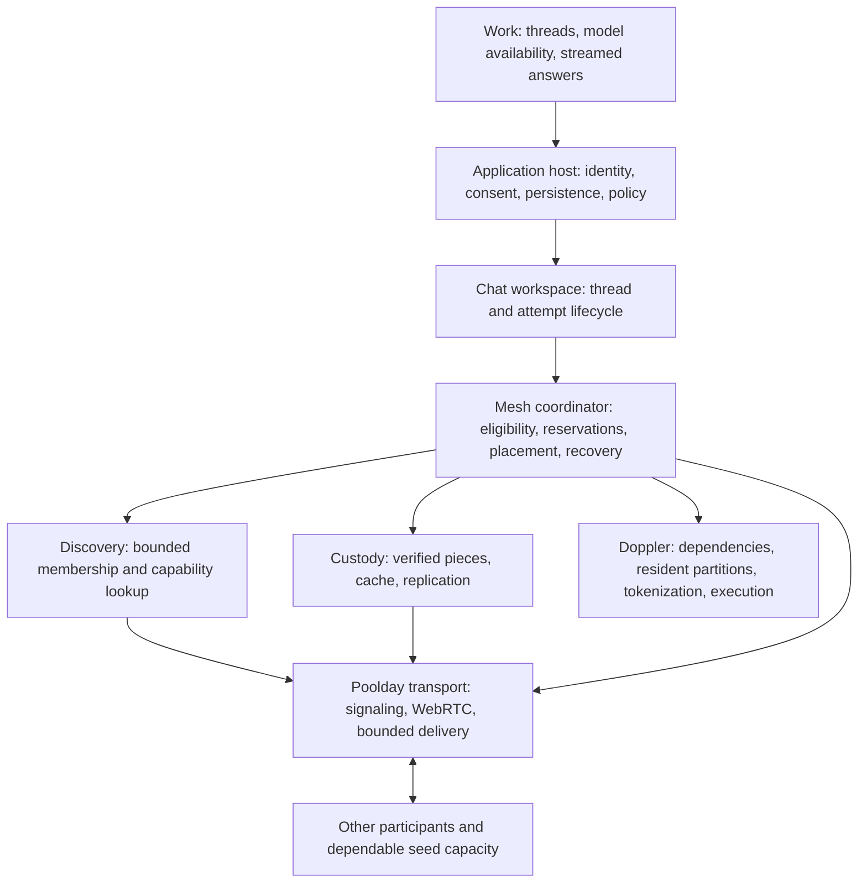
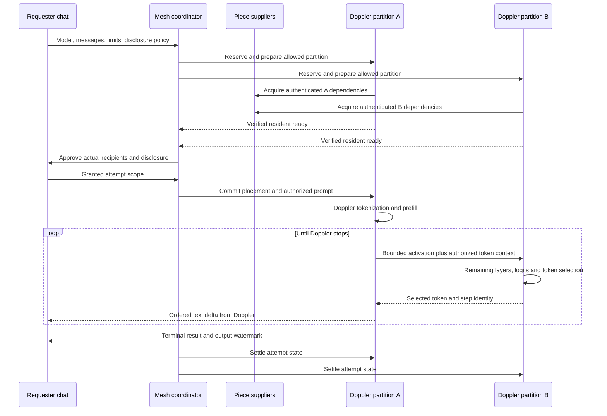

# Reploid open mesh architecture

## Technical diagrams

These views trace the ordinary distributed conversation through the implementation
at `1c8860f4`. They describe ownership and message flow, not a qualification result.
The README contains the diagrams; their source owners and contracts remain here.
The dated design and its original gap ledger remain below. Solid arrows in the
component view are calls or data flow; dotted arrows supply observations.

### Component ownership

[View this diagram in the README.](../README.md#component-ownership)

The host passes `swarm.partitions` into `createChatSession`; it does not import
model mathematics into the chat library. Discovery reports candidates. Placement
selects an eligible path; each resident owns admission and reservation settlement.
File sharing, compute contribution, and input disclosure retain separate grants.
Signaling establishes connections; a relay may carry WebRTC traffic when needed.

| Boundary | Implementation |
| --- | --- |
| View and application lifetime | [product-session.js](../self/host/product-session.js), [conversation-workspace.js](../self/ui/pool-home/conversation-workspace.js) |
| Durable threads and dispatch | [chat-session.js](../self/host/chat-session.js), [workspace.js](../packages/reploid/src/chat/workspace.js), [chat-execution.js](../self/host/chat-execution.js) |
| Discovery and placement | [automatic-partitions.js](../packages/reploid/src/mesh/partitions/automatic-partitions.js), [partition-discovery.js](../packages/reploid/src/mesh/partitions/partition-discovery.js), [partition-placement.js](../packages/reploid/src/mesh/partitions/partition-placement.js) |
| Admission and resource ownership | [partition-entry.js](../packages/reploid/src/mesh/partitions/partition-entry.js), [resident-partition.js](../packages/reploid/src/mesh/partitions/resident-partition.js), [partition-reservations.js](../packages/reploid/src/mesh/partitions/partition-reservations.js) |
| Piece acquisition and runtime opening | [work-model-files.js](../self/host/work-model-files.js), [work-partitions.js](../self/host/work-partitions.js) |

### Preparation and the generation loop

This is the implemented two-partition path. Reploid on contributor A coordinates
steps; Doppler on B owns sampling, text decoding, and stopping. A whole-request
peer invocation is a different path through the same chat execution adapter.

[View this diagram in the README.](../README.md#preparation-and-the-generation-loop)

The requester receives no weights on this path. Token context as well as
activations can leave A; intermediate tensors are not a privacy guarantee.
Shared endpoint weights can be substantial, so layer count is not a memory
estimate. The current host opens the pinned-manifest partition factory; this
must not be described as signed Capsule qualification merely because another
Doppler API supports Capsules.

Sequence owners: [partition-chat.js](../packages/reploid/src/mesh/partitions/partition-chat.js),
[partition-runner.js](../packages/reploid/src/mesh/partitions/partition-runner.js),
[partition-peer.js](../packages/reploid/src/mesh/partitions/partition-peer.js), and
[partition-step-receiver.js](../packages/reploid/src/mesh/partitions/partition-step-receiver.js).

### Attempt failure and recovery

The linked diagram shows selected transitions from the chat workspace. A retry
constructs a new attempt; it does not revive missing generation state.

[View this diagram in the README.](../README.md#attempt-failure-and-recovery)

Reload marks unfinished saved attempts interrupted; the user can explicitly retry.
UI navigation detaches a view rather than closing the application session.
Cancellation signals propagate to the owners, and cleanup can itself fail;
losing a connection cannot prove that the remote GPU stopped. See
[workspace.js](../packages/reploid/src/chat/workspace.js) and
[partition-runner.js](../packages/reploid/src/mesh/partitions/partition-runner.js).

## Original open-mesh design

Design date: 2026-10-01. Inspected baseline: `7f3f91d7`.

This is the implementation design for the requested open mesh experience. It is
not a release claim. The acceptance ledger below separates existing mechanisms,
missing integration, and required proof. The governing boundaries remain
[GOALS](../GOALS.md), [CATSCAN](../CATSCAN.md), and the
[network plan](poolday/executable-intelligence-network-plan.md).

## 1. Product contract

A person opens Reploid, discovers models the reachable network can serve, chooses
what inputs may leave their device, and receives a streamed answer. They never
need to create a room, invite someone, select computers, or acquire the complete
model on the requesting device. Storage and computation are separate optional
contributions with enforced limits and visible stop controls.

Conversations retain independent history, permissions, attempts, queues and
cancellation. Model identity remains fixed through a conversation unless the
person deliberately changes it. A disappearing contributor does not erase an
answer or cause another attempt's text to be appended to it.

The decisive proof is ordinary chat across physical machines: authenticated model
pieces arrive from peers with the origin unavailable; different machines execute
different Doppler partitions; their combined allowed capacity supports a model
that no participant can run alone under those same limits. Successful whole-job
offload, multiple browser contexts, and mock executors are separate evidence.

## 2. What exists and what is missing

| Boundary | Inspected implementation | Required delta |
| --- | --- | --- |
| Chat ownership | `packages/reploid/src/chat/` owns threads, grants, attempts and scheduling | Connect all execution paths through the same lifecycle and durable history |
| Application composition | `self/ui/pool-home/index.js` constructs `createChatSession` without its `partitions` port | Install a host-owned mesh coordinator and supply its partition execution port |
| Discovery | Automatic public bootstrap exists; `swarm-bootstrap.json` uses a public namespace with a 64-peer room ceiling | Discover beyond one room through bounded peer sampling and paged capability lookup |
| Whole-request execution | Normal chat uses prepared peer providers and Doppler | Complete actual-model acquisition/generation/failure acceptance |
| Model custody | Signed transfer, supplier fallback, verified files, OPFS staging and `createPieceAcquisition` exist | Connect the piece acquisition API to normal chat, Doppler's pinned piece index, complementary retention and repair |
| Storage bug | Whole shards are reread during preflight/weight loading; under a small quota repeated acquisition can exhaust transport/supply limits | Correct staging accounting; then move runtime range reads to independently authenticated pieces |
| Partition execution | Resident, runner, entry, grants and binary transport APIs exist | Automatic preparation, placement, catalog readiness and ordinary-page composition |
| Doppler delivery | Whole-model browser runtime is 0.6.2; installed/partition candidate is 0.6.3-dev.split.1 | One immutable package and browser delivery with matching public APIs |
| New Doppler source | Sibling source exports manifest residents and verified piece storage | Package, contract-test and integrate these exports; source existence is not delivered compatibility |
| Proof | Same-machine diagnostic partition evidence exists; latest normal-page P2P model test failed during loading | Public API, physical-device, origin-loss, combined-capacity and recovery evidence |

The older [system architecture](system-architecture.md) primarily describes the
agent/VFS substrate. It does not describe the complete open mesh chat path. That
substrate remains independently owned; this design does not create another agent
loop or merge the Work, Zero and X lifecycles.

## 3. Components and ownership

| Owner | Responsibility | Must not decide |
| --- | --- | --- |
| UI in `self/ui/pool-home/` | Render immutable state; dispatch thread, consent, contribution and stop actions | Routing, protocol retries, model math or implied permission |
| Host in `self/host/` | Compose services, persist identity/history/grants, supply policy and storage ports | Invent partition semantics or silently expand grants |
| `reploid/chat` | Thread and attempt state, approvals, ordered deltas, explicit retry | Select learned experts, verify model math or download models implicitly |
| Mesh library | Eligibility, capacity reservations, automatic placement, repair decisions, observations | Override Doppler dependencies or resource/disclosure limits |
| Custody library | Inventory, source selection, verified retention, replication and transfer recovery | Authorize prompt execution or choose executable code from peer advertisements |
| Poolday transport | Peer connections, authenticated channels, framing, backpressure, reconnection | Interpret tensors or declare an answer correct |
| Doppler public package | Artifact/plan verification, dependencies, memory estimates, tokenization, GPU execution, sampling, stopping and state reconstruction | Discovery, membership, peer placement or product presentation |

Add the coordinator inside the existing mesh owner, not as a UI controller or
second scheduler. Host code supplies browser capabilities. Library imports stay
inert, independently instantiable and free of browser globals or Doppler imports.
New component charters accompany implementation, not this design alone.

The proposed host-facing coordinator accepts `identity`, `catalog`, `grants`,
`policy`, `transport`, `custody`, `runtime` and `store` ports. It exposes model
availability subscriptions, an execution adapter for the existing chat owner,
contribution preparation/drain/stop, and asynchronous close. Chat continues to own
`request`, `signal`, `onState`, `onDelta` and approval callbacks. The coordinator
borrows the existing scheduler; it does not own a second conversation store.
Model readiness, UI progress and dispatch all derive from the same coordinator
snapshot, with a monotonically increasing revision to reject stale updates.

## 4. Identity and wire contracts

Reuse existing signed envelopes and attempt bindings. Version extensions where
old peers cannot honor a required field; unknown versions fail explicitly.
The following are target logical records, not claims of current exported types:

| Record | Bound fields |
| --- | --- |
| Artifact identity | Manifest digest, tokenizer digest, piece-index digest, adapter identities and allowed runtime/plan identities |
| Participant session | Signing key identity, session epoch, authenticated transport binding and bounded expiry |
| Capability advertisement | Participant/session, sequence, expiry, exact artifacts/plans/partitions, supported execution settings, free allocation budget, slots and readiness |
| Piece offer | Verified piece identities or paged inventory commitment, supplier identity, serving allowance and expiry |
| Resource grant | Storage/compute/egress scopes, ceilings, accepted catalog, expiry and revocation generation |
| Disclosure grant | Requester, thread, model/adapters, recipient set or explicitly approved recipient policy, payload scope, expiry and revocation generation |
| Reservation | Provider/session, model/plan/partition, owned allocation bytes, attempt slots, nonce and lease expiry |
| Placement | Requester, thread, attempt, generation, ordered partitions, reservations, exact runtime/settings and disclosure bindings |
| Step envelope | Placement, attempt, partition, sequence, token position, input/output digest, shape/dtype, bounded length and deadline |
| Attempt result | Status, stop reason, contiguous output watermark, model/settings identities, allocations, costs, failures and settlement |

Signatures establish identity and integrity, not honest GPU execution, physical
independence, or numerical correctness. Advertisements are expiring claims;
reservation and resident validation are required before dispatch. Peer-provided
metadata never selects executable JavaScript. The application admits exact model
artifacts from its catalog policy; discovering an unknown model is not admission.

## 5. Automatic discovery that stays bounded

Opening the page joins discovery automatically. It grants no storage, compute or
input disclosure. The existing public namespace becomes a bootstrap entry rather
than the entire network or a room the user must manage.

1. Bootstrap returns a bounded sample of reachable peers and directory contacts.
   Use multiple replaceable bootstrap endpoints; established peers can introduce
   replacements. The requester does not receive the global membership list.
2. Maintain a bounded neighbor sample with periodic replacement and expiring
   liveness. Control channels share the same connection budget as data channels.
3. Exchange signed capability digests and paged records through bounded gossip.
   Do not rebroadcast complete inventories or every participant's full state.
4. Publish short-lived model/plan capability leases to several directory contacts.
   Directory responsibility is distributed and replicated; each contact retains
   only a bounded set of leased records and advertises whether it can accept more.
   Entries are hints, not authoritative ownership or execution permission.
5. Search local records, then directory contacts and bounded overlay queries.
   Deduplicate query IDs; enforce hop, fanout, response-byte and deadline limits.
   Follow returned candidates only while a query budget remains.
6. Expire stale capabilities and verify candidates directly before reservation.
   Loss of bootstrap does not terminate existing peer sessions. A new isolated
   participant still requires a reachable entrypoint; this limitation is explicit.

For directory lookup, use content-derived keys binding protocol namespace, model
identity, plan and capability kind. Partition hot provider lists into fixed
provider-hash buckets; query buckets incrementally with a cursor instead of
returning an unbounded list. The admitted catalog supplies model identities for
initial browsing. Store each bucket lease at three discovered directory contacts
near its key, using bounded iterative key-distance lookup. Contacts reject records
when full, return bounded alternatives, and expire old leases. Publishers renew
and repair missing copies with jitter. Each participant keeps at most 512 routing
contacts as metadata, while live connections remain capped at 16; lookup does not
keep every visited contact connected. A lookup can return incomplete coverage or
exhaust its budget. No advertisement or placement depends on consensus about a
global membership ring. Bucket counts and protocol limits are versioned so peers
agree on discovery keys; overload triggers bounded pagination or rejection, never
silent enlargement of local storage.

A bounded query can miss an available model. Report the state of reachable
capacity, not global absence. No finite-degree, finite-query design guarantees
instant global knowledge. Larger networks gain aggregate storage and execution
capacity without requiring every device to retain all peers or inventories.

Directory records contain artifact/capability metadata, never prompts, histories,
or activations. TURN or another authorized relay may carry encrypted transport
when direct WebRTC fails; relay usage consumes the same declared traffic budget.
Server admission remains rate-limited and replaceable. Increasing one room's
peer ceiling is not the scaling architecture.

Request-only clients do not need WebGPU or a local Doppler resident. Probe
execution/storage support before offering contribution; an unsupported device
can still use reachable intelligence. Deployment must provide a secure browser
context and working signaling/relay configuration. Browser suspension and quota
eviction are normal lifecycle events, not exceptional promises to keep a tab alive.

## 6. Contribution, custody and replication

Storage permission, compute permission and disclosure are distinct grants.
Compute consent may authorize acquiring the assigned dependency set; it does not
authorize redistribution. Storage consent may authorize receiving and serving
identified pieces; it does not authorize reading conversation inputs.

Doppler supplies or verifies an independently pinned piece index covering exact
artifact ranges. Every piece is authenticated against that index before use.
A peer's transfer-generated chunk hash alone cannot authenticate a model range.
Transport frames are subdivisions of pieces; the two identities remain distinct.

Acquisition order is verified local pieces, authorized peers, then permitted
mirrors/origin. The origin-loss proof disables both final fallbacks. A partition
fetches only its declared dependencies, plus explicitly declared shared endpoint
weights/tokenizer assets. The requester fetches no weights unless it separately
chooses to contribute execution.

Use stable content-addressed pieces for retention, interrupted transfers and
cross-model reuse. Keep a small durable piece index, a bounded hot-memory cache
and bounded disk storage. Acquire one piece once per compatible cancellation
scope; shared transfers use subscriber reference counts so cancelling one reader
does not cancel another thread's required read. Remove abandoned staging after
its lease expires. Corrupt/missing cached bytes invalidate their index entries
and trigger bounded reacquisition; metadata is never proof of content.

Reserve disk space for staging and atomic replacement before admission. Count
current staging once. Account memory independently: in-flight buffers, retained
hot pieces, verification workspace, GPU weights, activations and per-attempt
state all require separate ceilings. Avoid an unbounded promise cache that keeps
every downloaded shard resident in JavaScript.

The replication controller chooses missing replicas from model demand and
verified reachable inventory, under existing storage/egress grants. It issues
expiring reservations before transfer and advertises a replica only after
verification and commit. Begin with deterministic placement favoring distinct
reachable participants and available budgets. Participant identities are not
evidence of different physical failure domains. Dependable seed operators supply
initial availability; ordinary peers can retain complementary pieces.

Replica loss schedules bounded repair with jitter and per-model repair leases.
Duplicate repairs are tolerable within budgets; no global consensus is required.
Avoid repair storms using queue limits, expiry and backoff. Do not evict pinned
dependencies or promised replicas to admit speculative work. At capacity, reject
new reservations or expire optional replicas explicitly. Stopping storage sharing
withdraws offers and settles owned transfers without expanding another grant.

## 7. One Doppler dependency and explicit readiness

Ship one immutable Doppler artifact with matching Node and browser public exports.
Record package integrity and runtime identity in every execution receipt.

Upgrade the pinned archive, lockfile, browser assets and application adapter in
one reviewed change. Test the installed package, not a sibling source override.
Peers negotiate protocol/runtime compatibility before reservations; mismatches
remain unavailable instead of downloading code from a peer. Retain a rollback
package and reject new assignments before retiring an incompatible resident.
Deploy matching application and runtime manifests atomically, then verify the
served bytes separately from local test results.
Reploid must not import private kernels or manually reconstruct model state.

The dependency must expose these capabilities, using existing API names where
available and versioned extensions for missing contracts:

- Verify exact manifest, piece index, runtime settings and valid partition plans.
- Describe each partition's required pieces, shared dependencies, tensor boundary,
  weight allocation, workspace, per-attempt state, context and concurrency limits.
- Open a resident partition through verified storage; report ready only after its
  required resources and executable state exist.
- Tokenize with the exact model template/tokenizer; execute a step; preserve
  sampling, penalties, stopping and numerical settings across the split.
- Close an attempt separately from shared resident weights; expose cancellation
  settlement and release owned resources on close.
- Define whether a continuation is local-only, exportable, reconstructible or
  unavailable. State required model/plan/settings/token/RNG/KV or recurrent data.

The sibling's `createManifestResidentPartitionFactory` and
`createVerifiedPieceStorage` are candidate public integration surfaces. The
manifest path must not be described as signed Capsule qualification. Choose and
record the verification path for each admitted artifact; never silently fall
back from a failed signed Capsule gate to a less restrictive path.

Model availability is a projection of compatible, fresh capabilities and complete
dependency coverage. Distinguish ready, preparing, busy and unavailable. A model
can be ready through a whole resident or a complete supported partition plan.
Dispatch still requires fresh reservations because readiness can race with
another request. A peer count or an artifact inventory never means ready.

## 8. Automatic placement and admission

The requester owns the attempt and placement generation. It coordinates a bounded
number of candidates; there is no permanent central scheduler.

1. Resolve the selected exact model, adapters, context/output limits and disclosure
   policy. Reject unsupported combinations before sending inputs.
2. Enumerate Doppler-supported complete plans from the catalog. Preserve original
   layer positions, shared weights and expert selection. The initial executable
   plan has two contiguous groups; do not claim arbitrary DAG execution from it.
3. Filter candidates by identities, settings, resource grant, disclosure eligibility,
   liveness, memory, context and available slots. These are hard constraints.
4. Rank eligible placements deterministically using residency, missing verified
   bytes, measured link cost, queue depth and failure observations. Freeze this
   baseline before evaluating learned routing.
5. Request provider-owned reservations for all required resources. Each provider
   admits atomically against its local ledger. Partial placement reservations
   expire or are released if any member refuses; never keep them indefinitely.
6. Prepare missing resident dependencies under compute grants, revalidate the
   descriptors, then commit the complete placement under the requester generation.
   Preparation may be proactive for contributed popular models, within budgets.
7. Resolve disclosure approval for the actual recipient scope. A changed recipient
   needs new approval unless the person explicitly granted that replacement policy.
8. Dispatch only after the complete plan is ready. Charge bounded failed preparation
   and reservation costs to their owners; report why admission failed.

Reservations use local expiry/monotonic timers plus conservative wire deadlines;
there is no assumption of perfectly synchronized clocks. Lease nonces, session
epochs and placement generations fence stale messages. The provider is final
authority for its capacity. No scheduler may overcommit because an advertisement
claimed space that another request has since consumed.

## 9. The complete token path

Every generated token traverses both groups. B does not execute an independent
whole-model request. A and B keep separate attempt-owned KV/recurrent state;
threads share immutable weights only. The prompt-owning device can be a third
participant with no weights. The existing partition entry protocol is the basis
for that path; ordinary UI integration and streamed requester deltas still need
explicit acceptance.

Use bounded binary activation frames, with identity/shape/dtype/length validation
before allocation and upload. Reordered or duplicated steps cannot advance
generation twice. Backpressure pauses upstream work; an unconsuming requester
must not cause unbounded GPU work, buffered deltas or relay queues. A terminal
result is accepted only after all deltas through its watermark are present.

Schedule among authenticated participants, then among their threads. Separate
prefill and decode work; bound prefill size or use Doppler-supported chunks so a
large prompt cannot indefinitely starve active decodes. Initial two-partition
execution uses fair token leases. Whole-request scheduling keeps its own explicit
fairness granularity until the runtime supports safe yielding. Neither thread
IDs nor extra unauthenticated identities should manufacture unlimited slots.
Cryptographic identity alone does not solve Sybil resistance.

## 10. Cancellation, failure and recovery

Attempt states are persisted independently of the rendered conversation:

`created -> awaiting-permission -> reserving -> preparing -> queued -> executing
-> completed | failed | interrupted | cancelling -> cancelled`

Completion/failure may enter settlement internally before resources are reusable.
Record the terminal outcome and outstanding settlement separately; a cancelled
label must not claim that submitted GPU work has already stopped.

| Failure | Required behavior |
| --- | --- |
| Supplier disappears | Keep verified pieces; select another authorized supplier within byte/attempt/deadline bounds |
| Corrupt piece | Reject before runtime use; invalidate cache entry; retain failure; try another eligible source |
| Storage or memory pressure | Reclaim unpinned cache; reject or replan within grants; never silently exceed budgets |
| Stale capacity | Release incomplete reservations; refresh candidates; preserve draft/attempt identity rules |
| Executor disappears before output | Replan under the same user-visible request with a recorded new attempt and applicable approval |
| Executor disappears after output | Preserve partial answer as interrupted; offer a distinct retry, or continue only through a qualified Doppler recovery contract |
| Lost or duplicate result | Resume delivery using attempt and sequence identities; do not rerun a completed step merely to redeliver it |
| Requester reloads | Restore transcript and mark unresolved work interrupted; do not redispatch automatically |
| Cancel one thread | Revoke its attempt, signal each owner, await settlement and release its leases; preserve other threads and weights |
| Stop contribution | Withdraw new admission immediately; explicit drain or stop policy governs active work; close only owned resources |
| Bootstrap outage | Existing connections continue; bounded reconnect attempts expose discovery degradation |
| Runtime mismatch | Reject before preparing or disclosing; do not import an advertised remote runtime |

A replacement cannot resume from a token counter alone. A valid continuation
requires all state Doppler declares, including RNG/sampling, KV/recurrent state,
exact token history and execution settings where applicable. If Doppler supports
reconstruction, replay through its API under a new placement generation, validate
the committed output prefix and suppress replayed deltas. Otherwise start a new
attempt. No silent splice and no fabricated missing state.

Recovery is bounded by one deadline, retry count and cumulative byte/compute
budget per attempt lineage. Nested retries do not each receive a fresh unlimited
budget. A runtime cleanup failure retires that resident rather than contaminating
the next conversation.

## 11. Resource policy

Store transcripts, grants, attempts and their output watermarks transactionally
in IndexedDB; keep large verified content in OPFS. Version schemas and retain
migration/rollback tests. Browser tabs sharing an origin must not overwrite a
whole workspace snapshot independently: transactions and revision checks own
updates, while a bounded notification channel refreshes views. Use a per-device
resource ledger and fenced leadership when tabs share one contribution budget.
Distinct requester identities do not create duplicate ownership of the same GPU
reservation. A persistence failure must remain visible and must not falsely
acknowledge that an answer or grant is durable.

Put policy in versioned JSON. The values below distinguish current settings from
initial design ceilings; new ceilings require implementation and stress evidence.

| Resource | Current setting or target policy | Admission rule |
| --- | --- | --- |
| Peer connections | Target 16 total; custody already has a 16-peer limit | Includes discovery, transfer and execution; reuse connections; expire idle peers |
| Capability records | Target 256 retained records; paged responses | Expire oldest/stale records; bounded lookup instead of global inventory |
| Routing contacts | Target 512 metadata records, independent of live connections | Bounded replacement; direct validation before using a contact |
| Discovery queries | Target 4 active, 8 hops, fanout 2, 256 KiB total response budget each | Reject/defer extra queries; cap duplicate cache and request rate |
| File transfers | Current 4 acquisitions, 4 supplier candidates | Count the entire acquisition, not only the request handshake |
| Transfer staging | Current 64 MiB OPFS | Reserve before acquisition; verified commit releases staging |
| Artifact retention | Current ceiling 3 GiB, reduced by actual browser quota | Include staging/atomic replacement once and reserve non-cache usage |
| Serving traffic | Current 4 GiB per explicit sharing session | Retain counters across reconnects; require an explicit renewed grant to reset |
| Piece geometry | Target pinned pieces no larger than 256 KiB | Smaller independent reads; transport frames remain separately bounded |
| Transport buffers | Current custody buffer ceiling 1 MiB per channel | Backpressure and aggregate device ceiling; no hidden unbounded send queue |
| Execution memory | Doppler dependency/workspace/state estimate plus host ceiling | Sum resident, pending reservation and active-attempt allocations before admission |
| Chat queues | Current 32 queued, 8 active attempts, 2 requests per participant | Provider ledger may impose stricter device limits; reject visibly at capacity |
| Conversation history | Current 64 threads, 256 messages/thread, bounded message size | Atomic persistence; explicit retention/export behavior before deleting user history |
| Attempt evidence | Current maximum 4,096 recorded attempts | Bounded summaries; stream detailed experiment traces to explicit artifacts |

Browser storage estimates and WebGPU allocations are not measurements of total
physical disk or VRAM. Report observed quota, controlled allocations and configured
ceilings separately. Account clocks, buffers and cancelled-but-unsettled work in
stress tests. Background/suspended browser tabs are unreliable contributors;
expire their leases rather than treating a saved ready flag as current capacity.

## 12. UX derived from actual lifecycle

Keep the existing Work, Network and Changes navigation. Work centers on threads,
the selected model, messages and the composer. Network provides progressively
disclosed contribution and connection details. Changes retains its independent
evaluation/adoption purpose.

- Entry renders immediately, restores threads and begins discovery. No invitation
  or peer-selection wizard blocks chat. Empty results explain discovery or missing
  reachable capacity; the draft remains editable.
- The model chooser projects serveable models and preparation/busy states. An
  existing thread keeps its selected unavailable model so its identity is visible.
  Queuing requires bounded admission, not an indefinitely enabled Send button.
- Before disclosure, explain the actual scope: local-only, exact recipients, or
  an explicitly approved mesh recipient policy. Tokens and activations are
  input-derived disclosures, not privacy-preserving substitutes for text.
- Progress reflects real events: waiting for capacity, acquiring verified bytes,
  preparing partitions, queueing, generating, reconnecting and settling a stop.
  A percent needs a known denominator. Never use a synthetic progress timer.
- Each thread retains its own busy/approval/error state. Navigating threads neither
  cancels nor redirects output. Stop targets the visible attempt explicitly.
- Retry preserves the failed/partial response and identifies the new attempt.
  New recipients or settings visibly follow the applicable permission policy.
- Contribution controls show allowed and used storage, traffic and computation,
  active work and stopping state. Compute and file sharing have separate toggles.
- Responsive layouts, keyboard focus, accessible status announcements, contrast,
  reduced motion and light/dark behavior are part of acceptance. Do not announce
  every token to assistive technology or hide the composer behind progress panels.

These are interaction requirements, not final marketing copy. The user's promise
“access intelligence beyond your device” requires the combined-capacity proof.

## 13. Implementation order and exit evidence

Each row produces a reviewable runtime change and an executable check. Parallel
work is possible only where dependencies permit; no gate is replaced by copy.

| Step | Concrete delta and owner | Exit evidence |
| --- | --- | --- |
| 1 | Freeze exact catalog artifacts, runtime identity, limits and failing normal-page reproduction | Retained baseline failure, hardware/browser IDs and origin-access trace |
| 2 | Repair bounded artifact/staging accounting and interrupted-file index recovery | Same-quota real model load; corruption/eviction/reopen tests; no increased supply limit hiding repeated reads |
| 3 | Deliver one compatible Doppler package with public residents, dependency descriptions and verified piece storage | Installed-package and browser export parity; exact artifact rejection; public API numerical conformance |
| 4 | Replace whole-shard range acquisition with stable authenticated pieces; add complementary inventories and retention leases | Origin-off acquisition of only required ranges; per-source byte ledger; restart/corruption/cancellation tests |
| 5 | Extend discovery from public bootstrap to bounded sampling, directory leases and queries | Join/leave/churn test with per-device connection, state, bandwidth and query caps unchanged as network size grows |
| 6 | Add provider-owned resource reservations and deterministic automatic partition placement | Simultaneous-request admission, expiry, partial reservation rollback, stale advertisement and consent tests |
| 7 | Compose residents, custody, placement and partition entry into normal chat startup | Three ordinary clients: requester without weights, A/B with distinct partitions, actual streamed Doppler output |
| 8 | Qualify isolated multi-thread execution, stop, delivery replay and valid reconstruction/retry | Two live conversations, one cancelled, one completes; no shared KV/adapters; retained partial output and bounded cleanup |
| 9 | Add granted replication and bounded repair on contributor loss | Complementary sources plus a replica; origin disabled; one supplier lost; verified reconstruction and bounded duplicate work |
| 10 | Execute the full physical-device matrix and combined-capacity case | Identified machines and limits; unsplit infeasible under each individual ceiling; split answer within every ceiling |
| 11 | Qualify the UX and dependable launch capacity | Fresh-user first answer, clear consent, contribution stop, accessibility, network outage and repeat-use checks |
| 12 | Evaluate routing from measured results | Frozen deterministic baseline versus learned routing on unseen work; correctness, full costs, uncertainty and regressions retained |

Steps 3, 5 and the reservation contract can be developed independently of the
whole-request loading repair. Their integration still depends on verified public
runtime and custody boundaries. The existing network plan's scientific and
improvement experiments retain their own acceptance gates.

## 14. End-to-end acceptance matrix

Use exact catalog Qwen 0.8B for the initial actual-model baseline. Select the
combined-capacity model/plan from the same admitted catalog only after Doppler
dependency measurements establish feasible partition budgets. Record the exact
selection before that run; do not change it afterward to fit a favorable result.

| Run | Required evidence |
| --- | --- |
| Public dependency conformance | Installed and hosted same-package identities; split/unsplit activations/logits and stopping within predeclared tolerances; fixed-seed behavior under the declared settings |
| Ordinary-page whole request | Automatic discovery; peer model acquisition; real streamed answer; requester has no weights; origin disabled at executor |
| Ordinary-page split | Requester plus actual A/B residents; every token crosses both; dependency/allocated-weight logs show neither secretly loads the complete model |
| Physical split | A and B on different identified machines/GPUs using actual network transport; exact runtime/model receipts; third requester may share neither executor |
| Combined capacity | Full model cannot be admitted on either device under the same budgets; all split allocations including shared weights and attempt state fit; answer meets correctness criteria |
| Loss and corruption | Remove source, remove executor before/after output, corrupt cached/received piece, duplicate/reorder frames, expire grants; explicit expected recovery for each |
| Concurrency | Two independent threads with distinguishable prompts; simultaneous activity; cancel one; other succeeds; bounded fair scheduling and state cleanup |
| Sustained bounds | Repeated joins, departures, transfers, questions and stops; no growing connections, queues, orphan leases, OPFS staging or resident attempt state |
| Privacy/consent | Discovery alone sends no input or weights; contribution and disclosure independent; recipient changes and revocations enforced at execution boundaries |
| UX persistence | Reload preserves completed/partial history, draft and selected model; unresolved attempts become interrupted without automatic resend |

Every retained run includes commit/package/model identities, policy, physical
topology, grant scopes, all attempts, raw timestamps/bytes/allocations, errors and
the result. Same-machine tests and simulated failures are labeled as such.
Benchmarks compare the strongest feasible local and equivalent centralized
alternatives, counting preparation, transfer, verification, queueing, failures,
retries and cleanup. A skipped test is a gap, never a pass.

Launch metrics are first-answer success, time to first token and completion,
waiting/abandonment, repeat use, useful contributed capacity and recovery cost.
Seed a small admitted model set with dependable capacity; expand only after
reliability measurements support it. Learned routing cannot relax verification,
resource or disclosure constraints and is introduced after this baseline works.

## 15. Implementation checkpoint

The [retained checkpoint](../artifacts/open-mesh/20261001/README.md) records the
storage-accounting repair and four passing browser guard tests, including the
Verification Worker. The real normal-page test now reaches Doppler `Ready` from
peer files with the executor origin blocked and the same 320 MiB storage quota.
It then fails generation with the CPU-resident embedding/preloaded-row error.
That runtime boundary remains unresolved; this architecture is not a claim that
the product now works end to end.
