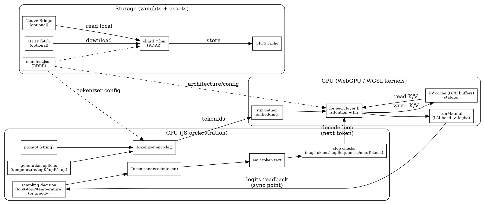

# Inference Module

This directory contains DOPPLER's inference pipeline and its main building blocks:

- `pipeline.ts`: end-to-end orchestration (prefill, decode loop, sampling, debug)
- `tokenizer.ts`: tokenizer backends and manifest-driven selection
- `kv-cache.ts`: KV cache layouts and policies (full and sliding-window)
- `moe-router.ts`: MoE routing and expert execution planning
- `speculative.ts`: speculative decoding scaffolding
- `pipeline/`: modular helpers (10 modules split for maintainability)
  - **WIRED**: `config.ts`, `sampling.ts` (imported by pipeline.ts)
  - **NOT wired**: `generate.ts`, `layer.ts`, `prefill.ts`, `decode.ts`, `embed.ts`, `stats.ts`, `stopping.ts`
  - See `REFACTOR-PLAN.md` for migration checklist

See also:
- [Line-by-Line Pipeline Steps](#line-by-line-pipeline-steps) below for detailed execution map
- `docs/GLOSSARY.md` for terms (logits, KV cache, workgroup, subgroups)
- `gpu/kernel-selector.ts` for the WGSL wrapper API (`run*` and `record*`)

---

## The Full Inference Graph (Conceptual)

This is the high-level execution graph for text generation. It is a dataflow graph with state (KV cache) plus a decode loop.



CPU and GPU boundary notes:

- `device.queue.submit()` schedules GPU work and returns immediately.
- `readBuffer(...)` for logits (or any GPU readback) creates a synchronization point.
- The KV cache is GPU-resident state that persists across decode steps.

---

## One Transformer Layer Graph (Kernel Names)

The per-layer graph below uses the kernel wrapper names from `gpu/kernel-selector.ts`. The actual WGSL variant selected depends on device features (`shader-f16`, `subgroups`) and runtime choices (attention tier, batching).

```dot
digraph DopplerLayer {
  rankdir=LR;
  node [shape=box, fontsize=10];

  x_in [label="hidden states X\n(GPUBuffer)"];

  norm1 [label="runRMSNorm"];
  q [label="runMatmul (Q)"];
  k [label="runMatmul (K)"];
  v [label="runMatmul (V)"];
  qnorm [label="runRMSNorm (Q)\n(optional)"];
  knorm [label="runRMSNorm (K)\n(optional)"];
  rope_q [label="runRoPE (Q)"];
  rope_k [label="runRoPE (K)"];
  kv_write [label="KV cache update\n(+ castF32ToF16 if enabled)"];
  attn [label="runAttention\n(tiled_large/tiled_small/streaming,\n_prefill or _decode variant)"];
  o [label="runMatmul (O)"];
  res1 [label="runResidualAdd"];

  norm2 [label="runRMSNorm\n(model-dependent)"];

  ffn_dense [label="Dense FFN path:\nrunMatmul -> runSiLU/runGeLU\n(or runSwiGLURowsplitBias)\n-> runMatmul"];
  ffn_moe [label="MoE FFN path:\ncomputeRouterLogitsGPU (uses runMatmul)\n-> runSoftmaxTopK\n-> runMoEGather\n-> expert matmuls (+ dequantizeMXFP4Expert)\n-> runScatterAddDynamic"];

  res2 [label="runResidualAdd"];
  x_out [label="hidden states X'\n(GPUBuffer)"];

  x_in -> norm1 -> q;
  norm1 -> k;
  norm1 -> v;

  q -> qnorm [style=dashed, label="if qkNorm"];
  k -> knorm [style=dashed, label="if qkNorm"];
  qnorm -> rope_q;
  knorm -> rope_k;
  q -> rope_q [style=dashed, label="else"];
  k -> rope_k [style=dashed, label="else"];

  rope_k -> kv_write;
  v -> kv_write;

  rope_q -> attn;
  kv_write -> attn;

  attn -> o -> res1;
  x_in -> res1 [style=dashed, label="skip"];

  res1 -> norm2;
  norm2 -> ffn_dense;
  norm2 -> ffn_moe;

  ffn_dense -> res2;
  ffn_moe -> res2;
  res1 -> res2 [style=dashed, label="skip"];

  res2 -> x_out;
}
```



Notes:

- Prefill and decode share the same graph, but use different attention behavior:
  - Prefill writes many KV entries and can use a different attention kernel path.
  - Decode appends one KV entry per step and reads the full cache for attention.
- Many kernels have both `run*` and `record*` forms:
  - `run*` submits immediately
  - `record*` records into a shared command buffer for batching

---

## Where WGSL Lives

WGSL kernels are in `gpu/kernels/`. The wrappers in `gpu/kernel-selector.ts` compile and dispatch them, selecting variants based on device capabilities and the operation's dtype.

---

## Line-by-Line Pipeline Steps

### Legend
```
[STEP]     = Required step
[STEP]?    = Conditional step
├─ FORK    = Model-specific branch
├─ DEP     = External dependency
└─ SKIP    = Step skipped under condition
```

---

### PHASE 0: INITIALIZATION

```
[0.1] getMemoryCapabilities()
      ├─ DEP: Browser Memory64 support (Chrome 111+, Firefox 119+)
      ├─ DEP: Unified memory detection (Apple Silicon, AMD Strix)
      └─ Output: { hasMemory64, isUnifiedMemory, maxHeapSize }

[0.2] initDevice()
      ├─ DEP: WebGPU adapter availability
      ├─ DEP: GPU features: shader-f16, subgroups, timestamp-query
      └─ Output: { device, hasF16, hasSubgroups, limits }

[0.3] loadManifestFromOPFS()
      ├─ DEP: OPFS support (Chrome 102+)
      ├─ ALT: Native Bridge (if storageContext.loadShard provided)
      └─ Output: manifest JSON
```

---

### PHASE 1: MODEL LOADING

```
[1.1] DopplerLoader.init()
      ├─ FORK: Dense model on discrete GPU → Warning (10x slowdown expected)
      ├─ FORK: MoE model → Set useMoE flag
      └─ Output: Loader ready

[1.2] _buildTensorLocations()
      └─ Output: Map<tensorName, {shard, offset, size, shape, dtype}>

[1.3] _loadEmbeddings()
      ├─ FORK: Gemma 3 → "language_model.model.embed_tokens.weight"
      ├─ FORK: LLaMA/Mistral → "model.embed_tokens.weight"
      ├─ FORK: GPT → "wte.weight"
      ├─ DEP: GPU available → Upload to GPU buffer
      └─ Output: embeddings (GPUBuffer or Float32Array)

[1.4] _loadLayer(layerIdx) × numLayers
      │
      ├─[1.4.1] Load inputNorm
      │         └─ "input_layernorm.weight"
      │
      ├─[1.4.2] Load Q/K/V/O projections
      │         ├─ FORK: Gemma 3 → "language_model.model.layers.{l}.self_attn.*"
      │         └─ FORK: LLaMA → "model.layers.{l}.self_attn.*"
      │
      ├─[1.4.3] Load Q/K norms?
      │         ├─ FORK: Gemma → Load "self_attn.q_norm.weight", "self_attn.k_norm.weight"
      │         └─ SKIP: LLaMA/Mistral (no Q/K norms)
      │
      ├─[1.4.4] Load postAttentionNorm?
      │         ├─ FORK: Gemma 3 → "post_attention_layernorm.weight"
      │         └─ SKIP: LLaMA (uses postNorm = post_attention_layernorm before FFN)
      │
      ├─[1.4.5] Load preFeedforwardNorm?
      │         ├─ FORK: Gemma 3 → "pre_feedforward_layernorm.weight"
      │         └─ SKIP: LLaMA/Mistral
      │
      ├─[1.4.6] Load postFeedforwardNorm?
      │         ├─ FORK: Gemma 3 → "post_feedforward_layernorm.weight"
      │         └─ SKIP: LLaMA/Mistral
      │
      ├─[1.4.7] Load FFN weights (Dense only)
      │         ├─ FORK: Dense layer → Load gate/up/down
      │         └─ SKIP: MoE layer (experts loaded on demand)
      │
      └─[1.4.8] F16 downcast?
                ├─ DEP: hasF16 = true → Downcast Q/K/V/O/gate/up/down to F16
                └─ SKIP: No F16 support → Keep F32

[1.5] loadExpert(layerIdx, expertIdx)? [MoE only, on-demand]
      ├─ FORK: MoE model → Load when router selects expert
      └─ SKIP: Dense model

[1.6] _loadFinalWeights()
      ├─[1.6.1] Load finalNorm
      │         ├─ FORK: Gemma 3 → "language_model.model.norm.weight"
      │         └─ FORK: LLaMA → "model.norm.weight"
      │
      └─[1.6.2] Load lmHead
                ├─ FORK: Tied embeddings → Reuse embeddings buffer (transposeB=true)
                └─ FORK: Untied → Load "lm_head.weight"

[1.7] Dequantization (during tensor load)
      ├─ FORK: Q4_K_M → dequantize() kernel
      │         ├─ DEP: hasSubgroups → dequant_subgroup (faster)
      │         └─ ALT: dequant_shared (fallback)
      ├─ FORK: BF16 → bf16_to_f32 kernel
      ├─ FORK: F16 + hasF16 → Direct GPU upload
      └─ FORK: F32 → Direct GPU upload
```

---

### PHASE 2: ROPE FREQUENCIES

```
[2.1] _initRoPEFrequencies()
      ├─ CONFIG: ropeTheta (default 10000, Gemma3=1000000)
      ├─ CONFIG: ropeScale (context extension factor)
      ├─ CONFIG: headDim (Gemma3=256, LLaMA=128)
      └─ Output: ropeFreqsCos, ropeFreqsSin (GPUBuffer)
```

---

### PHASE 3: KV CACHE

```
[3.1] KVCache initialization
      ├─ FORK: slidingWindow > 0 → SlidingWindowKVCache
      │         └─ CONFIG: Mistral slidingWindow=4096
      └─ FORK: No window → Standard KVCache

      ├─ DEP: hasF16 → F16 KV cache (50% memory)
      └─ ALT: F32 KV cache

      └─ Output: Per-layer K,V buffers [maxSeqLen × numKVHeads × headDim]
```

---

### PHASE 4: TOKENIZER

```
[4.1] Tokenizer.init()
      ├─ Load tokenizer.json (bundled or network)
      └─ Output: encode/decode functions
```

---

### PHASE 5: GENERATION START

```
[5.1] generate(prompt, options)
      │
      ├─[5.1.1] Apply chat template?
      │         ├─ FORK: Gemma → applyGemmaChatTemplate()
      │         │         "<bos><start_of_turn>user\n{prompt}<end_of_turn>\n<start_of_turn>model\n"
      │         └─ SKIP: Other models (raw prompt)
      │
      └─[5.1.2] Tokenize
                └─ Output: inputIds[]
```

---

### PHASE 6: PREFILL (Process entire prompt)

```
[6.1] _embed(inputIds)
      │
      ├─[6.1.1] runGather(tokenIds, embeddings)
      │         ├─ DEP: GPU → Zero-copy gather kernel
      │         └─ ALT: CPU loop
      │
      └─[6.1.2] Scale embeddings?
                ├─ FORK: Gemma → embeddings *= sqrt(hiddenSize)
                └─ SKIP: LLaMA/Mistral

[6.2] FOR l = 0 to numLayers-1:
      │
      └─ _processLayerGPU(l, hiddenStates, numTokens, isPrefill=true)
         │
         ├─[6.2.1] Detect norm architecture
         │         ├─ useSandwichNorm = (preFeedforwardNorm || postFeedforwardNorm) exists
         │         ├─ FORK: Gemma 3 → useSandwichNorm = true
         │         └─ FORK: LLaMA/Mistral → useSandwichNorm = false
         │
         ├─[6.2.2] _attentionGPU()
         │         │
         │         ├─[6.2.2.1] runRMSNorm(input, inputNorm)
         │         │
         │         ├─[6.2.2.2] Q = runMatmul(normed, qProj, transposeB=true)
         │         ├─[6.2.2.3] K = runMatmul(normed, kProj, transposeB=true)
         │         ├─[6.2.2.4] V = runMatmul(normed, vProj, transposeB=true)
         │         │
         │         ├─[6.2.2.5] Q/K norms?
         │         │           ├─ FORK: Gemma → runRMSNorm(Q, qNorm), runRMSNorm(K, kNorm)
         │         │           └─ SKIP: LLaMA/Mistral
         │         │
         │         ├─[6.2.2.6] runRoPE(Q, K, freqsCos, freqsSin)
         │         │
         │         ├─[6.2.2.7] runAttention(Q, K, V, kvCache)
         │         │           ├─ DEP: sharedMem >= 49KB → prefill_large (tileSize=64)
         │         │           ├─ DEP: sharedMem >= 8KB → prefill_small (tileSize=32)
         │         │           └─ ALT: prefill_streaming (no shared mem)
         │         │           ├─ DEP: hasF16 → *_f16kv variant (F16 KV in shared mem)
         │         │           └─ Output: attnOutput
         │         │
         │         └─[6.2.2.8] output = runMatmul(attnOutput, oProj, transposeB=true)
         │
         │ ┌─────────────────────────────────────────────────────────────┐
         │ │ FORK: useSandwichNorm (Gemma 3)                             │
         │ ├─────────────────────────────────────────────────────────────┤
         ├─[6.2.3a] postAttnNormed = runRMSNorm(attnOutput, postAttentionNorm)
         ├─[6.2.4a] postAttn = runResidualAdd(postAttnNormed, input)  ← RESIDUAL AFTER NORM
         ├─[6.2.5a] ffnInput = runRMSNorm(postAttn, preFeedforwardNorm)
         ├─[6.2.6a] ffnOutput = _feedForwardGPU() or _moeFeedForwardGPU()
         ├─[6.2.7a] ffnNormed = runRMSNorm(ffnOutput, postFeedforwardNorm)
         └─[6.2.8a] output = runResidualAdd(ffnNormed, postAttn)      ← RESIDUAL AFTER NORM
         │ └─────────────────────────────────────────────────────────────┘
         │
         │ ┌─────────────────────────────────────────────────────────────┐
         │ │ FORK: Standard (LLaMA/Mistral)                              │
         │ ├─────────────────────────────────────────────────────────────┤
         ├─[6.2.3b] postAttn = runResidualAdd(attnOutput, input)      ← RESIDUAL FIRST
         ├─[6.2.4b] normed = runRMSNorm(postAttn, postAttnNorm)
         ├─[6.2.5b] ffnOutput = _feedForwardGPU() or _moeFeedForwardGPU()
         └─[6.2.6b] output = runResidualAdd(ffnOutput, postAttn)      ← RESIDUAL AFTER FFN
         │ └─────────────────────────────────────────────────────────────┘
         │
         │ ┌─────────────────────────────────────────────────────────────┐
         │ │ _feedForwardGPU (Dense)                                     │
         │ ├─────────────────────────────────────────────────────────────┤
         │ ├─ gate = runMatmul(input, ffnGate, transposeB=true)
         │ ├─ up = runMatmul(input, ffnUp, transposeB=true)
         │ ├─ gated = runSiLU(gate) * up
         │ └─ output = runMatmul(gated, ffnDown, transposeB=true)
         │ └─────────────────────────────────────────────────────────────┘
         │
         │ ┌─────────────────────────────────────────────────────────────┐
         │ │ _moeFeedForwardGPU (MoE) [Mixtral, etc.]                    │
         │ ├─────────────────────────────────────────────────────────────┤
         │ ├─ routerLogits = runMatmul(input, routerWeight)
         │ ├─ (expertIndices, expertWeights) = runSoftmaxTopK(routerLogits, topK)
         │ ├─ FOR each selected expert:
         │ │   ├─ loadExpert(layerIdx, expertIdx) if not cached
         │ │   ├─ gathered = runMoEGather(input, expertIndices)
         │ │   ├─ expertOut = _feedForwardGPU(gathered, expertWeights)
         │ │   └─ output = runScatterAdd(output, expertOut, expertIndices)
         │ └─────────────────────────────────────────────────────────────┘
         │
         └─ Output: hiddenStates for next layer

[6.3] _computeLogits(finalHiddenStates, numTokens)
      │
      ├─[6.3.1] runRMSNorm(hiddenStates, finalNorm)
      │
      ├─[6.3.2] logits = runMatmul(normed, lmHead)
      │         ├─ FORK: Tied embeddings → transposeB=true
      │         └─ FORK: Untied → transposeB=true (SafeTensors layout)
      │
      └─[6.3.3] Extract last position logits
                └─ Output: logits[vocabSize] for position (numTokens-1)
```

---

### PHASE 7: SAMPLING

```
[7.1] _applyRepetitionPenalty(logits, generatedIds, penalty)
      └─ logits[token] /= penalty for each token in history

[7.2] _sample(logits, opts)
      │
      ├─[7.2.1] Temperature scaling
      │         └─ logits /= temperature
      │
      ├─[7.2.2] Top-P (nucleus)?
      │         ├─ CONFIG: topP < 1.0 → Apply
      │         └─ SKIP: topP = 1.0
      │
      ├─[7.2.3] Top-K?
      │         ├─ CONFIG: topK > 0 → Apply
      │         └─ SKIP: topK = 0
      │
      └─[7.2.4] Softmax + categorical sample
                └─ Output: nextToken
```

---

### PHASE 8: DECODE LOOP

```
[8.1] WHILE tokensGenerated < maxTokens AND NOT stopped:
      │
      ├─[8.1.1] _embed([lastToken])
      │         └─ Same as prefill but numTokens=1
      │
      ├─[8.1.2] FOR l = 0 to numLayers-1:
      │         │
      │         └─ _processLayerGPU(l, hiddenStates, numTokens=1, isPrefill=false)
      │            │
      │            └─ Attention uses DECODE kernel variant:
      │               ├─ DEP: sharedMem → decode kernel (256 workgroup)
      │               ├─ Reads full KV cache from previous positions
      │               └─ Appends new K,V to cache
      │
      ├─[8.1.3] _computeLogits(hiddenStates, 1)
      │         └─ Output: logits[vocabSize] for position 0
      │
      ├─[8.1.4] _sample(logits, opts)
      │         └─ Output: nextToken
      │
      ├─[8.1.5] Check stop conditions
      │         ├─ stopTokenIds from modelConfig (model-specific)
      │         └─ Check stopSequences in generated text
      │
      └─[8.1.6] currentSeqLen++
```

---

## External Dependencies Summary

| Dependency | Detection | Impact |
|------------|-----------|--------|
| **Memory64** | `getMemoryCapabilities().hasMemory64` | >4GB heap allocation |
| **Unified Memory** | `getMemoryCapabilities().isUnifiedMemory` | Dense model performance |
| **WebGPU** | `getDevice()` | GPU vs CPU path |
| **shader-f16** | `getKernelCapabilities().hasF16` | F16 matmul, F16 KV cache |
| **subgroups** | `getKernelCapabilities().hasSubgroups` | Fast dequantization |
| **Shared Memory** | `device.limits.maxComputeWorkgroupStorageSize` | Attention kernel variant |
| **OPFS** | Browser support | Model storage |
| **Native Bridge** | `storageContext.loadShard` | Bypass OPFS, mmap access |

---

## Model-Specific Forks Summary

| Step | Gemma 3 | LLaMA/Mistral | Mixtral |
|------|---------|---------------|---------|
| Tensor prefix | `language_model.model.layers` | `model.layers` | `model.layers` |
| Q/K norms | Yes | No | No |
| Embedding scale | `*= sqrt(hiddenSize)` | No | No |
| Norm architecture | Sandwich (4 norms) | Standard (2 norms) | Standard (2 norms) |
| Residual pattern | Norm BEFORE residual | Residual BEFORE norm | Residual BEFORE norm |
| FFN type | Dense | Dense | MoE (8 experts, top-2) |
| Sliding window | 1024 | None / 4096 (Mistral) | None |
| Stop tokens | From manifest | From manifest | From manifest |
| Chat template | Yes | No | No |

---

## Key Architecture Differences

### Sandwich Norm (Gemma 3) vs Standard (LLaMA/Mistral)

```
┌─────────────────────────────────────────────────────────────────────┐
│ STANDARD (LLaMA, Mistral, Mixtral)                                  │
├─────────────────────────────────────────────────────────────────────┤
│ x = x + attn(input_norm(x))           ← residual wraps attention    │
│ x = x + ffn(post_attn_norm(x))        ← residual wraps FFN          │
└─────────────────────────────────────────────────────────────────────┘

┌─────────────────────────────────────────────────────────────────────┐
│ SANDWICH (Gemma 3)                                                  │
├─────────────────────────────────────────────────────────────────────┤
│ h = attn(input_norm(x))                                             │
│ h = post_attention_norm(h)            ← norm ON attention output    │
│ x = x + h                             ← then residual add           │
│ h = ffn(pre_feedforward_norm(x))                                    │
│ h = post_feedforward_norm(h)          ← norm ON FFN output          │
│ x = x + h                             ← then residual add           │
└─────────────────────────────────────────────────────────────────────┘
```

---

## Files Reference

| File | Purpose |
|------|---------|
| `inference/pipeline.ts` | Main inference loop, layer processing |
| `loader/doppler-loader.ts` | Weight loading, tensor naming |
| `gpu/kernel-selector.ts` | Kernel dispatch based on capabilities |
| `memory/capability.ts` | Memory64, unified memory detection |
| `inference/kv-cache.ts` | KV cache management |
| `gpu/device.ts` | WebGPU device, feature detection |

---

*Last updated: December 2025*
