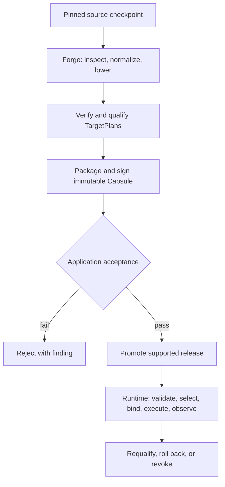

<p align="center">
  
</p>

# doppler-gpu

[](https://github.com/clocksmith/doppler/actions/workflows/check-green.yml)
[](https://www.npmjs.com/package/doppler-gpu)
[](https://github.com/clocksmith/doppler/blob/main/LICENSE)

Doppler is a model compiler, release foundry, and WebGPU runtime for JavaScript.
Forge turns supported model sources into signed immutable Capsules with
ModelIR-derived, qualified TargetPlans. Runtime verifies, selects, binds, and
executes the declared JavaScript/WGSL program. Browser and Node paths are
qualified separately; Bun remains experimental.

## Mission, goal, and value

Make useful AI capabilities installable, inspectable, and maintainable as
application dependencies. Success means an independent application voluntarily
retains Doppler for a measured improvement and ships a second revision with less
release effort. Free adoption counts; benchmarks alone do not prove it.

Applications control trust and updates. This checkout introduces the breaking
[Capsule naming migration](docs/capsule-naming-migration.md); former Pack APIs
and schemas are not accepted. Capsule v2 and v3 are supported;
[Capsule v3](docs/capsule-identity-migration.md) separates executable identity from
release events. Doe, Poolday, and Reploid are optional, not prerequisites.

Build local generation, embeddings, or reranking, or contribute improvements to
source interpretation, kernels, loading, and release reliability. See the
[goals](docs/goals.md) and [contribution guide](docs/contributing.md).

## How to use Doppler

Run the CLI without installing a global package:

```bash
npx doppler-gpu "Summarize WebGPU in one sentence"
npx doppler-gpu --model qwen3-0.8b --prompt "Write a haiku about GPUs"
npx doppler-gpu --list-models
```

The live browser demo is at [d4da.com/doppler](https://d4da.com/doppler).
The first documentation path is [getting started](https://github.com/clocksmith/doppler/blob/main/docs/getting-started.md),
followed by the [Capsule Runtime API](https://github.com/clocksmith/doppler/blob/main/docs/api/root.md).

For the release-foundry path, the installed command is `doppler release`; from
npm use `npx --package doppler-gpu doppler release`. It consumes a pinned
`production-release/v1` manifest and signed exact-device receipts, then emits an
`eligible` or `blocked` decision and retained evidence. It never activates or
deploys the customer application. See the [release platform contract](docs/model-release-platform.md)
and [CLI reference](docs/cli.md).

Generation can explicitly adopt [plan-bound GPU token selection](docs/integration/capsule-token-selection.md) while retaining the same public operation and stream contracts.

### Capsule Runtime API

```js
import { openCapsule } from 'doppler-gpu/host';
import { reviewedRelease } from './reviewed-release.js';

const session = await openCapsule(reviewedRelease.capsuleUrl, {
  trustedSigners: reviewedRelease.trustedSigners,
  acceptedTargetPlanDigests: reviewedRelease.acceptedTargetPlanDigests,
});
try {
  const result = await session.rerank({
    application: reviewedRelease.application,
    query: 'Which API provides browser GPU compute?',
    documents: ['WebGPU exposes GPU compute.', 'WebSocket transports messages.'],
    options: {},
  });
  console.log(result, session.selectedTargetPlanDigest);
} finally {
  await session.close();
}
```

`reviewedRelease` is application-owned configuration, not metadata trusted merely
because it was downloaded. It identifies a reranker Capsule, accepted plans, trusted
publishers, and the application/workload/oracle contract. The host entry composes
the existing device, artifact-store, and program ports; trust and upgrades remain
explicit. See the [Electron integration](examples/electron-document-search/README.md)
and [retained evaluation](docs/integration/reranker-evaluation.md).

Advanced applications can still inject every port through `doppler-gpu` or
`doppler-gpu/runtime`. Both routes verify the same Capsule and initial execution
identity. The host facade does not add model operations or broaden qualification.

Discover repository commands with `npm run` or `npm pkg get scripts` (JSON).
Use `doppler --help` for the installed CLI.

The former manifest-loading facade remains available only as an explicit
compatibility import:

```js
import { dr } from 'doppler-gpu/compat';

const session = await dr.open('qwen3-0.8b');
const result = await session.generate('Describe WebGPU briefly');
await session.close();
```

### OpenAI-compatible server

```bash
npx doppler-serve --model qwen3-0.8b --port 8080
```

The server accepts requests at `http://localhost:8080/v1`. Registry IDs resolve
to hosted RDRR artifacts from `clocksmith/rdrr` by default.

### LoRA loading and training

```bash
npx doppler-gpu lora --config ./workload.json --surface node
```

Doppler supports SafeTensors LoRA loading and hot swap at runtime. SFT/LoRA
training is available through the experimental Node, Bun, and browser training
surface. Cataloged adapter identities and lifecycle states are listed in
[`models/adapters/catalog.json`](models/adapters/catalog.json). See the
[LoRA format](docs/lora-format.md), [training handbook](docs/training-handbook.md),
and [Training API](docs/api/training.md).

<!-- model-type-clusters:start -->

## Supported RDRR model types

Doppler classifies artifacts by what they consume and produce. This is
separate from lineage (`family`), runtime implementation (`modelType`), and
artifact-size tier.

| Type | Input → output | Runtime-verified / cataloged | Representative lanes |
| --- | --- | --- | --- |
| Text generators | text → text | 13 / 17 | gemma-3-1b-it-q4k-ehf16-af32<br>gemma-3-270m-it-f16-af32<br>gemma-3-270m-it-q4k-ehf16-af32<br>+14 more |
| Multimodal generators | audio + image + text → text | 3 / 3 | gemma-4-e2b-it-q4k-ehf16-af16-int4ple<br>gemma-4-e2b-it-q4k-ehf16-af32<br>gemma-4-e2b-it-q4k-ehf16-af32-int4ple |
| Diffusion language models | text → text | 0 / 1 | diffusiongemma-26b-a4b-it-q4k-ehf16-af16 |
| Translation specialists | text → text | 2 / 2 | translategemma-4b-1b-enes-q4k-ehf16-af32<br>translategemma-4b-it-q4k-ehf16-af32 |
| Language embedders | text → pooled-embedding | 2 / 2 | google-embeddinggemma-300m-q4k-ehf16-af32<br>qwen-3-embedding-0-6b-q4k-ehf16-af32 |
| Rerankers | text-pair → relevance-score | 2 / 2 | qwen-3-reranker-0-6b-f16-af32<br>qwen-3-reranker-0-6b-q4k-ehf16-af32 |
| Protein encoders | protein-sequence → pooled-embedding + token-embedding + token-logits | 3 / 3 | amplify-120m-f16-af32<br>esm2-t12-35m-ur50d-f32-af32<br>esmc-300m-f32-af32 |
| Nucleotide encoders | dna-sequence → pooled-embedding + token-embedding | 1 / 1 | nucleotide-transformer-v2-50m-f32-af32 |

The [full model-support matrix](https://github.com/clocksmith/doppler/blob/main/docs/model-support-matrix.md)
lists every lane and its lifecycle evidence. Classification says what an
artifact is shaped to do; only lifecycle receipts establish what is
verified, and a runtime pass does not by itself qualify every declared input
modality.

<!-- model-type-clusters:end -->

## Evidence

Doppler has accepted browser WebGPU comparisons with higher steady-state inference throughput
(higher is faster) than Transformers.js where the declared workload correctness and
throughput gates pass. Loading is a separate measurement; the referenced
Vulkan embedding and reranker artifacts load faster in Transformers.js. The
[scoreboard](https://github.com/clocksmith/doppler/blob/main/docs/model-competition-scoreboard.md)
links the receipts and the [benchmark methodology](https://github.com/clocksmith/doppler/blob/main/docs/benchmark-methodology.md)
defines the gates.


## Release and execution flow



Candidates begin as pinned source truth. Forge owns graph-changing work and
emits an immutable Capsule only after verification and qualification. Application
acceptance authorizes promotion. Runtime never repairs or specializes the Capsule;
it selects a qualified TargetPlan, binds resources, executes declared commands,
and emits evidence for continuing qualification and recovery decisions.

## Long-term vision

Doppler is intended to support a growing set of local model families and
runtime variants without hiding the model contract or execution path. Registered
variant calibration, paired performance gates, and WGSL experiments remain
human-reviewed. Ouroboros and Reploid sit above Doppler as orchestration or
product layers; Doppler owns the artifact and execution boundary.

New model families require RDRR conversion and may require tokenizer, graph, or
kernel support. Native packed-Q4K LoRA support is available for the declared
Qwen target; other packed-Q4K training targets use external backends.

## Limits and current status

WebGPU is required. Use a current Chromium browser; Node installs the WebGPU
provider as an optional dependency. A runtime pass does not verify every input
modality, and a receipt records what ran without establishing output quality.
Throughput comparisons are valid only when the workload, timing scope, and
correctness path are comparable. Unsupported paths fail closed.

## Repository map

- [Component charters](https://github.com/clocksmith/doppler/blob/main/CATSCAN.md) — recursive repository and subsystem intent
- [Component index](https://github.com/clocksmith/doppler/blob/main/docs/component-index.md) — generated authority and parent map
- [`src/`](src/) — runtime, model loading, inference, and execution contracts
- [`demo/`](demo/) — browser demo and its public API boundary
- [`models/adapters/`](models/adapters/) — adapter catalog, lifecycle, identity, and evidence metadata
- [`benchmarks/`](benchmarks/) — vendor comparisons and retained results
- [`docs/`](docs/) — APIs, architecture, formats, methodology, and release matrices
- [`tests/`](tests/) — runtime, contract, browser, and benchmark tests
- [`tools/`](tools/) — conversion, qualification, and operator tools

## Read next

- [Documentation index](https://github.com/clocksmith/doppler/blob/main/docs/INDEX.md)
- [Architecture](https://github.com/clocksmith/doppler/blob/main/docs/architecture.md)
- [RDRR format](https://github.com/clocksmith/doppler/blob/main/docs/rdrr-format.md)
- [Local GPU challenger framework](https://github.com/clocksmith/doppler/blob/main/docs/local-gpu-challenger-framework.md)
- [Program Bundles](https://github.com/clocksmith/doppler/blob/main/docs/integration/program-bundle.md)

## License

[MIT License](LICENSE). See [NOTICE](NOTICE) for attribution.
